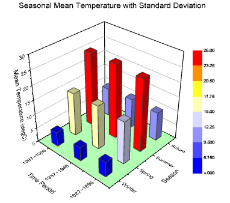
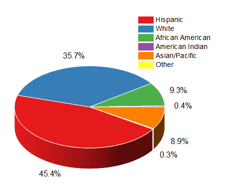

## Figures are Fundamental

- Allow us to swiftly convey a message

- Easier to compare than numbers

- Can capture your audience

\

```{r set-up}
# Load packages
pacman::p_load("conflicted",      # Solve conflicts in packages
               "dplyr",           # Data wrangling
               "magrittr",        # Better pipelines
               "tidyr",           # Tidying up data
               "tibble",          # Better data frames
               "ggplot2",         # Data visualisation
               "ggpattern",       # Patterns in ggplots
               "patchwork",       # Patching plots together
               "plotly",          # Interactive plots
               "fmsb",            # Spider charts
               "knitr",           # Printing output
               "thematic",        # Printed output background colours
               "kableExtra",      # More table printing options
               "viridis",         # Colourblind colouring
               "dichromat",       # Simulating colourblindness
               "scales",          # More colour scales
               "colorspace",      # Desaturating colours
               "palmerpenguins"   # Example data
)

# Solve conflicts
conflicts_prefer(plotly::layout)
conflicts_prefer(plotly::filter)
conflicts_prefer(palmerpenguins::penguins)
               
# Standard theme
theme_standard <- function(){
    # Set theme
    theme(legend.position = "bottom",
          legend.title = element_blank(),
          legend.background = element_rect(fill = "#f0f1eb", colour = "#f0f1eb"),
          panel.background = element_rect(fill = "#f0f1eb", colour = "#f0f1eb"),
          panel.grid = element_blank(),
          plot.background = element_rect(fill = "#f0f1eb", colour = "#f0f1eb"),
          plot.title = element_text(hjust = 0.5, face = "bold", size = 12),
          plot.subtitle = element_text(hjust = 0.5, face = "italic", size = 9),
          axis.line = element_line(),
          strip.background = element_rect(fill = "#f0f1eb", colour = "#f0f1eb"),
          strip.text = element_text(hjust = 0.5, face = "bold"))
}

# Change background colours
thematic_rmd(bg = "#f0f1eb")

```

::::: {.fragment}
:::: {.columns}
::: {.column width="50%"}
```{r figures over tables - table}
# Prepare data
(dat_example <- penguins %>%
    # Group per species and island
    group_by(island, species) %>%
    # Get mean flipper length per group
    summarise(mfl = round(mean(flipper_length_mm, na.rm = TRUE), 1), .groups = "keep")) %>%
    # Change column names
    set_colnames(c("Island", "Species", "Mean flipper length (mm)")) %>%
    # Kable table
    kable() %>%
    # Style table
    kable_styling(font_size = 18)

```
:::

::: {.column width="50%"}
```{r figures over tables - figure}
# Prepare data
ggplot(dat_example, aes(x = island, y = mfl, fill = species, label = mfl)) +
    # Geometries
    geom_bar(position = "dodge", stat = "identity") +
    geom_text(position = position_dodge(width = 0.9),
              vjust = -0.5) +
    # Scaling
    scale_x_discrete(name = "Island") +
    scale_y_continuous(name = "Mean flipper length (mm)",
                       limits = c(0, 250),
                       breaks = seq(0, 250, 50),
                       expand = c(0, 0)) +
    scale_fill_manual(values = viridis(4)[1:3]) +
    # Labels & guides
    ggtitle("Palmer penguins mean flipper length",
            subtitle = "By island and species") +
    guides(fill = guide_legend(override.aes = aes(label = ""))) +
    # Aesthetics
    theme_standard()

```
:::
::::
:::::

## Figures are Tricky

- Many styles to choose from

- Much freedom aesthetically

- Not a major focus of research

# Colour Coding

## Colouring for Colourblindness

- Not all colours are equally distinguishable

- Colourblindness can quickly make figures unreadable

- More than one type of colourblindness exists

- Printing in black-and-white also makes you colourblind

::: footer
Colouring for Colourblindness (1/7)
:::

## Colouring for Colourblindness

Let's compare some different colour scales:

```{r true colours}
# Prepare data for visualisation of colour scales
dat_scales <- tibble(x = 1,
                     y = seq(-1, 1, length.out = 1e4))

# Base plot function
plot_base <- function(title){
    # Create plot
    ggplot(dat_scales, aes(x = x, y = y, fill = y)) +
        # Geometries
        geom_tile() +
        # Labels
        labs(title = title,
             xlab = "",
             ylab = "") +
        # Guides
        guides(fill = "none") +
        # Transformations
        coord_cartesian(expand = FALSE) 
}

# Rainbow plot
plot_rainbow <- plot_base("rainbow") +
    # Rainbow scaling
    scale_fill_gradientn(colours = rainbow(1e4))

# Rainbow plot
plot_heat <- plot_base("heat") +
    # Rainbow scaling
    scale_fill_gradientn(colours = heat.colors(1e4))

# Default ggplot plot
plot_ggplot_default <- plot_base("ggplot default") +
    # Default ggplot scaling
    scale_fill_gradientn(colours = seq_gradient_pal("#132B43", "#56B1F7")(seq(0, 1, length.out = 1e4)))

# Diverging ggplot plot
plot_ggplot_diverging <- plot_base("ggplot diverging") +
    # Default divergent scaling
    scale_fill_gradientn(colours = div_gradient_pal(muted("red"), "white", muted("blue"))(seq(0, 1, length.out = 1e4)))

# Binary ggplot plot
plot_ggplot_binary <- 
    # Create plot
    ggplot(mutate(dat_scales, y = if_else(y > 0, 1, 0)), aes(x = x, y = y, fill = as.factor(y))) +
        # Geometries
        geom_tile() +
        # Labels
        labs(title = "ggplot binary",
             xlab = "",
             ylab = "") +
        # Guides
        guides(fill = "none") +
        # Transformations
        coord_cartesian(expand = FALSE) +
        # Binary scaling
        scale_fill_manual(values = hue_pal()(2))

# Ternary ggplot plot
plot_ggplot_ternary <- 
    # Create plot
    ggplot(mutate(dat_scales, y = case_when(y < -0.33 ~ 1, y > 0.33 ~ 3, .default = 2)), aes(x = x, y = y, fill = as.factor(y))) +
        # Geometries
        geom_tile() +
        # Labels
        labs(title = "ggplot ternary",
             xlab = "",
             ylab = "") +
        # Guides
        guides(fill = "none") +
        # Transformations
        coord_cartesian(expand = FALSE) +
        # Ternary scaling
        scale_fill_manual(values = hue_pal()(3))


# Viridis plot
plot_viridis <- plot_base("viridis") +
    # Viridis scaling
    scale_fill_gradientn(colours = viridis(1e4))

# Magma plot
plot_magma <- plot_base("magma") +
    # Magma scaling
    scale_fill_gradientn(colours = magma(1e4))

# IBM plot
plot_ibm <- plot_base("IBM") +
    # IBM scaling
    scale_fill_gradientn(colours = c("#648FFF",
                                     "#785EF0",
                                     "#DC267F",
                                     "#FE6100",
                                     "#FFB000"))

# Wong plot
plot_wong <- plot_base("Wong") +
    # Wong scaling
    scale_fill_gradientn(colours = c("#000000",
                                     "#E69F00",
                                     "#56B4E9",
                                     "#009E73",
                                     "#F0E442",
                                     "#0072B2",
                                     "#D55E00",
                                     "#CC79A7"))

# Tol plot
plot_tol <- plot_base("Tol") +
    # Tol scaling
    scale_fill_gradientn(colours = c("#332288",
                                     "#117733",
                                     "#44AA99",
                                     "#88CCEE",
                                     "#DDCC77",
                                     "#CC6677",
                                     "#AA4499",
                                     "#882255"))

# Combine plots
plot_palettes <- wrap_plots(plot_rainbow, plot_heat, plot_ggplot_default, plot_ggplot_diverging, 
                            plot_ggplot_binary, plot_ggplot_ternary, plot_viridis, plot_magma, 
                            plot_ibm, plot_wong, plot_tol,
                            nrow = 1) &
    # Aesthetics
    theme_standard() +
    theme(plot.title = element_text(size = 8),
          axis.line = element_blank(),
          axis.title = element_blank(),
          axis.text = element_blank(),
          axis.ticks = element_blank())

# Print plots
plot_palettes

```

::: footer
Colouring for Colourblindness (2/7)
:::

## Colouring for Colourblindness

Green-blind (deuteranopia):

```{r deuteranopia}
# Rainbow plot
plot_rainbow <- plot_base("rainbow") +
    # Rainbow scaling
    scale_fill_gradientn(colours = dichromat(rainbow(1e4), type = "deutan"))

# Rainbow plot
plot_heat <- plot_base("heat") +
    # Heat scaling
    scale_fill_gradientn(colours = dichromat(heat.colors(1e4), type = "deutan"))

# Default ggplot plot
plot_ggplot_default <- plot_base("ggplot default") +
    # Default ggplot scaling
    scale_fill_gradientn(colours = dichromat(seq_gradient_pal("#132B43", "#56B1F7")(seq(0, 1, length.out = 1e4)), type = "deutan"))

# Diverging ggplot plot
plot_ggplot_diverging <- plot_base("ggplot diverging") +
    # Divergent scaling
    scale_fill_gradientn(colours = dichromat(div_gradient_pal(muted("red"), "white", muted("blue"))(seq(0, 1, length.out = 1e4)), type = "deutan"))

# Binary ggplot plot
plot_ggplot_binary <- 
    # Create plot
    ggplot(mutate(dat_scales, y = if_else(y > 0.5, 1, 0)), aes(x = x, y = y, fill = as.factor(y))) +
        # Geometries
        geom_tile() +
        # Labels
        labs(title = "ggplot binary",
             xlab = "",
             ylab = "") +
        # Guides
        guides(fill = "none") +
        # Transformations
        coord_cartesian(expand = FALSE) +
    # Binary scaling
    scale_fill_manual(values = dichromat(hue_pal()(2), type = "deutan"))

# Ternary ggplot plot
plot_ggplot_ternary <- 
    # Create plot
    ggplot(mutate(dat_scales, y = case_when(y < -0.33 ~ 1, y > 0.33 ~ 3, .default = 2)), aes(x = x, y = y, fill = as.factor(y))) +
        # Geometries
        geom_tile() +
        # Labels
        labs(title = "ggplot ternary",
             xlab = "",
             ylab = "") +
        # Guides
        guides(fill = "none") +
        # Transformations
        coord_cartesian(expand = FALSE) +
    # Ternary scaling
    scale_fill_manual(values = dichromat(hue_pal()(3), type = "deutan"))

# Viridis plot
plot_viridis <- plot_base("viridis") +
    # Viridis scaling
    scale_fill_gradientn(colours = dichromat(viridis(1e4), type = "deutan"))

# Magma plot
plot_magma <- plot_base("magma") +
    # Magma scaling
    scale_fill_gradientn(colours = dichromat(magma(1e4), type = "deutan"))

# IBM plot
plot_ibm <- plot_base("IBM") +
    # IBM scaling
    scale_fill_gradientn(colours = dichromat(c("#648FFF",
                                               "#785EF0",
                                               "#DC267F",
                                               "#FE6100",
                                               "#FFB000"), type = "deutan"))

# Wong plot
plot_wong <- plot_base("Wong") +
    # Wong scaling
    scale_fill_gradientn(colours = dichromat(c("#000000",
                                               "#E69F00",
                                               "#56B4E9",
                                               "#009E73",
                                               "#F0E442",
                                               "#0072B2",
                                               "#D55E00",
                                               "#CC79A7"), type = "deutan"))

# Tol plot
plot_tol <- plot_base("Tol") +
    # Tol scaling
    scale_fill_gradientn(colours = dichromat(c("#332288",
                                               "#117733",
                                               "#44AA99",
                                               "#88CCEE",
                                               "#DDCC77",
                                               "#CC6677",
                                               "#AA4499",
                                               "#882255"), type = "deutan"))

# Combine plots
plot_palettes <- wrap_plots(plot_rainbow, plot_heat, plot_ggplot_default, plot_ggplot_diverging, 
                            plot_ggplot_binary, plot_ggplot_ternary, plot_viridis, plot_magma, 
                            plot_ibm, plot_wong, plot_tol,
                            nrow = 1) &
    # Aesthetics
    theme_standard() +
    theme(plot.title = element_text(size = 8),
          axis.line = element_blank(),
          axis.title = element_blank(),
          axis.text = element_blank(),
          axis.ticks = element_blank())

# Print plots
plot_palettes

```

::: footer
Colouring for Colourblindness (3/7)
:::

## Colouring for Colourblindness

Red-blind (protanopia):

```{r protanopia}
# Rainbow plot
plot_rainbow <- plot_base("rainbow") +
    # Rainbow scaling
    scale_fill_gradientn(colours = dichromat(rainbow(1e4), type = "protan"))

# Rainbow plot
plot_heat <- plot_base("heat") +
    # Heat scaling
    scale_fill_gradientn(colours = dichromat(heat.colors(1e4), type = "protan"))

# Default ggplot plot
plot_ggplot_default <- plot_base("ggplot default") +
    # Default ggplot scaling
    scale_fill_gradientn(colours = dichromat(seq_gradient_pal("#132B43", "#56B1F7")(seq(0, 1, length.out = 1e4)), type = "protan"))

# Diverging ggplot plot
plot_ggplot_diverging <- plot_base("ggplot diverging") +
    # Divergent scaling
    scale_fill_gradientn(colours = dichromat(div_gradient_pal(muted("red"), "white", muted("blue"))(seq(0, 1, length.out = 1e4)), type = "protan"))

# Binary ggplot plot
plot_ggplot_binary <- 
    # Create plot
    ggplot(mutate(dat_scales, y = if_else(y > 0.5, 1, 0)), aes(x = x, y = y, fill = as.factor(y))) +
        # Geometries
        geom_tile() +
        # Labels
        labs(title = "ggplot binary",
             xlab = "",
             ylab = "") +
        # Guides
        guides(fill = "none") +
        # Transformations
        coord_cartesian(expand = FALSE) +
    # Binary scaling
    scale_fill_manual(values = dichromat(hue_pal()(2), type = "protan"))

# Ternary ggplot plot
plot_ggplot_ternary <- 
    # Create plot
    ggplot(mutate(dat_scales, y = case_when(y < -0.33 ~ 1, y > 0.33 ~ 3, .default = 2)), aes(x = x, y = y, fill = as.factor(y))) +
        # Geometries
        geom_tile() +
        # Labels
        labs(title = "ggplot ternary",
             xlab = "",
             ylab = "") +
        # Guides
        guides(fill = "none") +
        # Transformations
        coord_cartesian(expand = FALSE) +
    # Ternary scaling
    scale_fill_manual(values = dichromat(hue_pal()(3), type = "protan"))

# Viridis plot
plot_viridis <- plot_base("viridis") +
    # Viridis scaling
    scale_fill_gradientn(colours = dichromat(viridis(1e4), type = "protan"))

# Magma plot
plot_magma <- plot_base("magma") +
    # Magma scaling
    scale_fill_gradientn(colours = dichromat(magma(1e4), type = "protan"))

# IBM plot
plot_ibm <- plot_base("IBM") +
    # IBM scaling
    scale_fill_gradientn(colours = dichromat(c("#648FFF",
                                               "#785EF0",
                                               "#DC267F",
                                               "#FE6100",
                                               "#FFB000"), type = "protan"))

# Wong plot
plot_wong <- plot_base("Wong") +
    # Wong scaling
    scale_fill_gradientn(colours = dichromat(c("#000000",
                                               "#E69F00",
                                               "#56B4E9",
                                               "#009E73",
                                               "#F0E442",
                                               "#0072B2",
                                               "#D55E00",
                                               "#CC79A7"), type = "protan"))

# Tol plot
plot_tol <- plot_base("Tol") +
    # Tol scaling
    scale_fill_gradientn(colours = dichromat(c("#332288",
                                               "#117733",
                                               "#44AA99",
                                               "#88CCEE",
                                               "#DDCC77",
                                               "#CC6677",
                                               "#AA4499",
                                               "#882255"), type = "protan"))

# Combine plots
plot_palettes <- wrap_plots(plot_rainbow, plot_heat, plot_ggplot_default, plot_ggplot_diverging, 
                            plot_ggplot_binary, plot_ggplot_ternary, plot_viridis, plot_magma, 
                            plot_ibm, plot_wong, plot_tol,
                            nrow = 1) &
    # Aesthetics
    theme_standard() +
    theme(plot.title = element_text(size = 8),
          axis.line = element_blank(),
          axis.title = element_blank(),
          axis.text = element_blank(),
          axis.ticks = element_blank())

# Print plots
plot_palettes

```

::: footer
Colouring for Colourblindness (4/7)
:::

## Colouring for Colourblindness

Blue-blind (tritanopia):

```{r tritanopia}
# Rainbow plot
plot_rainbow <- plot_base("rainbow") +
    # Rainbow scaling
    scale_fill_gradientn(colours = dichromat(rainbow(1e4), type = "tritan"))

# Rainbow plot
plot_heat <- plot_base("heat") +
    # Heat scaling
    scale_fill_gradientn(colours = dichromat(heat.colors(1e4), type = "tritan"))

# Default ggplot plot
plot_ggplot_default <- plot_base("ggplot default") +
    # Default ggplot scaling
    scale_fill_gradientn(colours = dichromat(seq_gradient_pal("#132B43", "#56B1F7")(seq(0, 1, length.out = 1e4)), type = "tritan"))

# Diverging ggplot plot
plot_ggplot_diverging <- plot_base("ggplot diverging") +
    # Divergent scaling
    scale_fill_gradientn(colours = dichromat(div_gradient_pal(muted("red"), "white", muted("blue"))(seq(0, 1, length.out = 1e4)), type = "tritan"))

# Binary ggplot plot
plot_ggplot_binary <- 
    # Create plot
    ggplot(mutate(dat_scales, y = if_else(y > 0.5, 1, 0)), aes(x = x, y = y, fill = as.factor(y))) +
        # Geometries
        geom_tile() +
        # Labels
        labs(title = "ggplot binary",
             xlab = "",
             ylab = "") +
        # Guides
        guides(fill = "none") +
        # Transformations
        coord_cartesian(expand = FALSE) +
    # Binary scaling
    scale_fill_manual(values = dichromat(hue_pal()(2), type = "tritan"))

# Ternary ggplot plot
plot_ggplot_ternary <- 
    # Create plot
    ggplot(mutate(dat_scales, y = case_when(y < -0.33 ~ 1, y > 0.33 ~ 3, .default = 2)), aes(x = x, y = y, fill = as.factor(y))) +
        # Geometries
        geom_tile() +
        # Labels
        labs(title = "ggplot ternary",
             xlab = "",
             ylab = "") +
        # Guides
        guides(fill = "none") +
        # Transformations
        coord_cartesian(expand = FALSE) +
    # Ternary scaling
    scale_fill_manual(values = dichromat(hue_pal()(3), type = "tritan"))

# Viridis plot
plot_viridis <- plot_base("viridis") +
    # Viridis scaling
    scale_fill_gradientn(colours = dichromat(viridis(1e4), type = "tritan"))

# Magma plot
plot_magma <- plot_base("magma") +
    # Magma scaling
    scale_fill_gradientn(colours = dichromat(magma(1e4), type = "tritan"))

# IBM plot
plot_ibm <- plot_base("IBM") +
    # IBM scaling
    scale_fill_gradientn(colours = dichromat(c("#648FFF",
                                               "#785EF0",
                                               "#DC267F",
                                               "#FE6100",
                                               "#FFB000"), type = "tritan"))

# Wong plot
plot_wong <- plot_base("Wong") +
    # Wong scaling
    scale_fill_gradientn(colours = dichromat(c("#000000",
                                               "#E69F00",
                                               "#56B4E9",
                                               "#009E73",
                                               "#F0E442",
                                               "#0072B2",
                                               "#D55E00",
                                               "#CC79A7"), type = "tritan"))

# Tol plot
plot_tol <- plot_base("Tol") +
    # Tol scaling
    scale_fill_gradientn(colours = dichromat(c("#332288",
                                               "#117733",
                                               "#44AA99",
                                               "#88CCEE",
                                               "#DDCC77",
                                               "#CC6677",
                                               "#AA4499",
                                               "#882255"), type = "tritan"))

# Combine plots
plot_palettes <- wrap_plots(plot_rainbow, plot_heat, plot_ggplot_default, plot_ggplot_diverging, 
                            plot_ggplot_binary, plot_ggplot_ternary, plot_viridis, plot_magma, 
                            plot_ibm, plot_wong, plot_tol,
                            nrow = 1) &
    # Aesthetics
    theme_standard() +
    theme(plot.title = element_text(size = 8),
          axis.line = element_blank(),
          axis.title = element_blank(),
          axis.text = element_blank(),
          axis.ticks = element_blank())

# Print plots
plot_palettes

```

::: footer
Colouring for Colourblindness (5/7)
:::

## Colouring for Colourblindness

Monochromacy (achromatopsia):

```{r achromatopsia}
# Rainbow plot
plot_rainbow <- plot_base("rainbow") +
    # Rainbow scaling
    scale_fill_gradientn(colours = desaturate(rainbow(1e4), amount = 1))

# Rainbow plot
plot_heat <- plot_base("heat") +
    # Heat scaling
    scale_fill_gradientn(colours = desaturate(heat.colors(1e4), amount = 1))

# Default ggplot plot
plot_ggplot_default <- plot_base("ggplot default") +
    # Default ggplot scaling
    scale_fill_gradientn(colours = desaturate(seq_gradient_pal("#132B43", "#56B1F7")(seq(0, 1, length.out = 1e4)), amount = 1))

# Diverging ggplot plot
plot_ggplot_diverging <- plot_base("ggplot diverging") +
    # Divergent scaling
    scale_fill_gradientn(colours = desaturate(div_gradient_pal(muted("red"), "white", muted("blue"))(seq(0, 1, length.out = 1e4)), amount = 1))

# Binary ggplot plot
plot_ggplot_binary <- 
    # Create plot
    ggplot(mutate(dat_scales, y = if_else(y > 0.5, 1, 0)), aes(x = x, y = y, fill = as.factor(y))) +
        # Geometries
        geom_tile() +
        # Labels
        labs(title = "ggplot binary",
             xlab = "",
             ylab = "") +
        # Guides
        guides(fill = "none") +
        # Transformations
        coord_cartesian(expand = FALSE) +
    # Binary scaling
    scale_fill_manual(values = desaturate(hue_pal()(2), amount = 1))

# Ternary ggplot plot
plot_ggplot_ternary <- 
    # Create plot
    ggplot(mutate(dat_scales, y = case_when(y < -0.33 ~ 1, y > 0.33 ~ 3, .default = 2)), aes(x = x, y = y, fill = as.factor(y))) +
        # Geometries
        geom_tile() +
        # Labels
        labs(title = "ggplot ternary",
             xlab = "",
             ylab = "") +
        # Guides
        guides(fill = "none") +
        # Transformations
        coord_cartesian(expand = FALSE) +
    # Ternary scaling
    scale_fill_manual(values = desaturate(hue_pal()(3), amount = 1))

# Viridis plot
plot_viridis <- plot_base("viridis") +
    # Viridis scaling
    scale_fill_gradientn(colours = desaturate(viridis(1e4), amount = 1))

# Magma plot
plot_magma <- plot_base("magma") +
    # Magma scaling
    scale_fill_gradientn(colours = desaturate(magma(1e4), amount = 1))

# IBM plot
plot_ibm <- plot_base("IBM") +
    # IBM scaling
    scale_fill_gradientn(colours = desaturate(c("#648FFF",
                                                "#785EF0",
                                                "#DC267F",
                                                "#FE6100",
                                                "#FFB000"), amount = 1))

# Wong plot
plot_wong <- plot_base("Wong") +
    # Wong scaling
    scale_fill_gradientn(colours = desaturate(c("#000000",
                                                "#E69F00",
                                                "#56B4E9",
                                                "#009E73",
                                                "#F0E442",
                                                "#0072B2",
                                                "#D55E00",
                                                "#CC79A7"), amount = 1))

# Tol plot
plot_tol <- plot_base("Tol") +
    # Tol scaling
    scale_fill_gradientn(colours = desaturate(c("#332288",
                                                "#117733",
                                                "#44AA99",
                                                "#88CCEE",
                                                "#DDCC77",
                                                "#CC6677",
                                                "#AA4499",
                                                "#882255"), amount = 1))

# Combine plots
plot_palettes <- wrap_plots(plot_rainbow, plot_heat, plot_ggplot_default, plot_ggplot_diverging, 
                            plot_ggplot_binary, plot_ggplot_ternary, plot_viridis, plot_magma, 
                            plot_ibm, plot_wong, plot_tol,
                            nrow = 1) &
    # Aesthetics
    theme_standard() +
    theme(plot.title = element_text(size = 8),
          axis.line = element_blank(),
          axis.title = element_blank(),
          axis.text = element_blank(),
          axis.ticks = element_blank())

# Print plots
plot_palettes

```

::: footer
Colouring for Colourblindness (6/7)
:::

## Colouring for Colourblindness

- Some colour scales are more accessible than others (viridis, magma, IBM. Wong, Tol)

- No colour scale is perfectly accessible (and red-yellow-green definitely isn't)

- Some journals/institutions require specific colours (corporate identity)

- Printing in black and white is often not sufficient

::: {.fragment}

We should always convey meaning with more than just colours!

:::

::: footer
Colouring for Colourblindness (7/7)
:::

## Substituting for Shapes

Shapes with areas can use patterns:

```{r patterns1}
# Create plot
ggplot(dat_example, aes(x = island, y = mfl, pattern = species, pattern_angle = species)) +
    # Geometries
    geom_bar_pattern(fill = "white", colour = "black", pattern_fill = "black", pattern_spacing = 0.025, position = "dodge", stat = "identity") +
    # Scaling
    scale_x_discrete(name = "Island") +
    scale_y_continuous(name = "Mean flipper length (mm)",
                       limits = c(0, 250),
                       breaks = seq(0, 250, 50),
                       expand = c(0, 0)) +
    # Labels
    ggtitle("Palmer penguins mean flipper length",
            subtitle = "By island and species") +
    # Aesthetics
    theme_standard()

```

::: footer
Substituting for Shapes (1/5)
:::

## Substituting for Shapes 

We can still use colours with patterns:

```{r patterns2}
# Create plot with coloured background
plot_pattern1 <- ggplot(dat_example, aes(x = island, y = mfl, fill = species, pattern = species, pattern_angle = species)) +
    # Geometries
    geom_bar_pattern(colour = "black",
                     pattern_colour = NA, 
                     pattern_fill = "white", 
                     pattern_spacing = 0.025, 
                     pattern_density = 0.25,
                     position = "dodge", 
                     stat = "identity") +
    # Scaling
    scale_x_discrete(name = "Island") +
    scale_y_continuous(name = "Mean flipper length (mm)",
                       limits = c(0, 250),
                       breaks = seq(0, 250, 50),
                       expand = c(0, 0)) +
    scale_fill_manual(values = c("#332288",
                                 "#117733",
                                 "#44AA99")) 

# Create plot with white background
plot_pattern2 <- ggplot(dat_example, aes(x = island, y = mfl, pattern = species, pattern_angle = species, pattern_fill = species)) +
    # Geometries
    geom_bar_pattern(colour = "black",
                     pattern_colour = NA, 
                     fill = "white", 
                     pattern_spacing = 0.015, 
                     pattern_density = 0.35,
                     position = "dodge", 
                     stat = "identity") +
    # Scaling
    scale_x_discrete(name = "Island") +
    scale_y_continuous(name = "Mean flipper length (mm)",
                       limits = c(0, 250),
                       breaks = seq(0, 250, 50),
                       expand = c(0, 0)) +
    scale_pattern_fill_manual(values = c("#332288",
                                         "#117733",
                                         "#44AA99")) 

# Combine plots
plot_pattern <- wrap_plots(plot_pattern1, plot_pattern2, ncol = 1, axes = "collect") +
    # Patchwork additions
    plot_annotation(title = "Palmer penguins mean flipper length",
                    subtitle = "By island and species") &
    # Additional aesthetics
    theme_standard() +
    theme(legend.position = "right")

# Show plots
plot_pattern

```

::: footer
Substituting for Shapes (2/5)
:::

## Substituting for shapes 

Or just go crazy...

```{r patterns3}
# Get images for patterns
seamless_image_filenames <- c(
  system.file('img', 'seamless1.jpg', package = 'ggpattern'),
  system.file('img', 'seamless2.jpg', package = 'ggpattern'),
  system.file('img', 'seamless3.jpg', package = 'ggpattern')
)

# Create plot
ggplot(dat_example, aes(x = island, y = mfl, pattern_filename = species)) +
    # Geometries
    geom_bar_pattern(pattern = "image",
                     pattern_type = "tile",
                     position = "dodge", stat = "identity") +
    # Scaling
    scale_x_discrete(name = "Island") +
    scale_y_continuous(name = "Mean flipper length (mm)",
                       limits = c(0, 250),
                       breaks = seq(0, 250, 50),
                       expand = c(0, 0)) +
    scale_pattern_filename_discrete(choices = seamless_image_filenames) +
    # Labels
    ggtitle("Palmer penguins mean flipper length",
            subtitle = "By island and species") +
    # Aesthetics
    theme_standard()

```

::: footer
Substituting for Shapes (3/5)
:::

## Substituting for Shapes

Lines can use linetypes:

```{r linetypes}
# Create plot
ggplot(penguins, aes(x = body_mass_g, y = flipper_length_mm, colour = island, fill = island, linetype = island)) +
    # Geometries
    geom_smooth(method = "lm", formula = "y ~ x", alpha = 0.3) +
    # Scaling
    scale_x_continuous(name = "Body mass (grams)",
                       limits = c(2500, 6500),
                       breaks = seq(2500, 6500, 500),
                       labels = prettyNum(seq(2500, 6500, 500), big.mark = ","),
                       expand = c(0, 0)) +
    scale_y_continuous(name = "Flipper length (millimeters)",
                       limits = c(170, 240),
                       breaks = seq(170, 240, 10)) +
    scale_colour_manual(values = viridis(4)[1:3], aesthetics = c("colour", "fill")) +
    scale_linetype_manual(values = c(1, 2, 3))  +
    # Labels
    ggtitle("Relation between penguin body mass and flipper length", subtitle = "Data from the Palmer Archipelago penguins") +
    guides(fill = "none",
           colour = guide_legend(position = "bottom")) + 
    # Aesthetics
    theme_standard()

```

::: footer
Substituting for Shapes (4/5)
:::

## Substituting for Shapes

One-dimensional objects can shapeshift: 

```{r points}
# Create plot
ggplot(penguins, aes(x = body_mass_g, y = flipper_length_mm, colour = island, fill = island, shape = island)) +
    # Geometries
    geom_point(alpha = 0.7) +
    # Scaling
    scale_x_continuous(name = "Body mass (grams)",
                       limits = c(2500, 6500),
                       breaks = seq(2500, 6500, 500),
                       labels = prettyNum(seq(2500, 6500, 500), big.mark = ","),
                       expand = c(0, 0)) +
    scale_y_continuous(name = "Flipper length (millimeters)",
                       limits = c(170, 240),
                       breaks = seq(170, 240, 10)) +
    scale_colour_manual(values = viridis(4)[1:3]) +
    scale_shape_manual(values = 15:17)  +
    # Labels
    ggtitle("Relation between penguin body mass and flipper length", subtitle = "Data from the Palmer Archipelago penguins") +
    guides(fill = "none",
           colour = guide_legend(position = "bottom")) + 
    # Aesthetics
    theme_standard()

```

::: footer
Substituting for Shapes (5/5)
:::

## Contrasting Colours

Colour contrast is important!

- We might want to show text in our figures

- The contrast between text and background colour is important for readability

::: footer
Contrasting Colours (1/5)
:::

## Contrasting Colours 
```{r bad contrast}
# Create plot
ggplot(dat_example, aes(x = island, y = mfl, fill = species, label = species)) +
    # Geometries
    geom_bar(position = "dodge", stat = "identity") +
    geom_text(aes(y = 15),
              position = position_dodge(width = 0.9)) +
    # Scaling
    scale_x_discrete(name = "Island") +
    scale_y_continuous(name = "Mean flipper length (mm)",
                       limits = c(0, 250),
                       breaks = seq(0, 250, 50),
                       expand = c(0, 0)) +
    scale_fill_manual(values = viridis(4)[1:3]) +
    # Labels
    ggtitle("Palmer penguins mean flipper length",
            subtitle = "By island and species") +
    # Guides
    guides(fill = "none") +
    # Aesthetics
    theme_standard()

```

::: footer
Contrasting Colours (2/5)
:::

## Contrasting Colours 

```{r good contrast}
# Update example data for different label colours
dat_example_contrast <- dat_example %>%
    # Create new variable
    mutate(contrast = if_else(species == "Gentoo", "black", "white"))

# Create plot
ggplot(dat_example_contrast, aes(x = island, y = mfl, fill = species, label = species)) +
    # Geometries
    geom_bar(position = "dodge", stat = "identity") +
    geom_text(aes(y = 15, colour = contrast, group = species),
              position = position_dodge(width = 0.9)) +
    # Scaling
    scale_x_discrete(name = "Island") +
    scale_y_continuous(name = "Mean flipper length (mm)",
                       limits = c(0, 250),
                       breaks = seq(0, 250, 50),
                       expand = c(0, 0)) +
    scale_fill_manual(values = viridis(4)[1:3]) +
    scale_colour_manual(values = c("black", "white")) +
    # Labels
    ggtitle("Palmer penguins mean flipper length",
            subtitle = "By island and species") +
    # Guides
    guides(colour = "none",
           fill = "none") +
    # Aesthetics
    theme_standard()

```

::: footer
Contrasting Colours (3/5)
:::

## Contrasting Colours 

```{r labelled contrast}
# Create plot
ggplot(dat_example_contrast, aes(x = island, y = mfl, fill = species, label = species, group = species)) +
    # Geometries
    geom_bar(position = "dodge", stat = "identity") +
    geom_label(aes(y = 15),
               fill = "white",
               position = position_dodge(width = 0.9)) +
    # Scaling
    scale_x_discrete(name = "Island") +
    scale_y_continuous(name = "Mean flipper length (mm)",
                       limits = c(0, 250),
                       breaks = seq(0, 250, 50),
                       expand = c(0, 0)) +
    scale_fill_manual(values = viridis(4)[1:3]) +
    # Labels
    ggtitle("Palmer penguins mean flipper length",
            subtitle = "By island and species") +
    # Guides
    guides(fill = "none") +
    # Aesthetics
    theme_standard()

```

::: footer
Contrasting Colours (4/5)
:::

## Contrasting Colours 

Contrast ratio's:

| Species   | All black | Mixed black-white | Labelled   |
|-----------|-----------|-------------------|------------|
| Adelie    | 1.4       | 15.2              | 21         |
| Chinstrap | 3.5       | 6.0               | 21         |
| Gentoo    | 8.2       | 8.2               | 21         |

Ideal is 7:1 or 4.5:1 for larger text

::: footer
Contrasting Colours (5/5)
:::

## More Materials

- Calculate contrast ratio's: [https://snook.ca/technical/colour_contrast/colour.html](https://snook.ca/technical/colour_contrast/colour.html)

- Considering colours: [https://blog.datawrapper.de/colors/](https://blog.datawrapper.de/colors/)

- Grey as a go-to: [https://visualisingdata.com/2015/01/make-grey-best-friend/](https://visualisingdata.com/2015/01/make-grey-best-friend/)

- Considering colourblindness: [https://blog.datawrapper.de/colorblindness-part2/#Colorblind-safe-color-palettes](https://blog.datawrapper.de/colorblindness-part2/#Colorblind-safe-color-palettes)

# Plotting Pitfalls

## Tricky or Tinkering?

- We have many design choices when making our figures

- Some design choices may influence the message we convey

- Other design choices influence whether we convey a message at all

## 3D < 2D 

- 3D barcharts? Don't.

- 3D piecharts? Don't.

- 3D scatterplots? Perhaps...

::: {layout-ncol=2}



:::

## 3D barcharts and piecharts

Issues:

- Distorted angles/bar heights

- Difficult to gauge exact values

- Extra dimension might be communicated through other means

## 3D scatterplots

```{r interactive 3d scatterplot}
# Create plot
plot_ly(penguins, 
        x = ~ body_mass_g, 
        y = ~ flipper_length_mm, 
        z = ~ bill_length_mm,
        type = "scatter3d",
        color = ~ species,
        colors = viridis(4)[1:3],
        mode = "markers",
        width = 900,
        height = 600) %>%
    # Add layout
    layout(title = "Relation between flippers, bill, and body mass of Palmer penguins",
           scene = list(xaxis = list(title = "Body mass (g)"),
                        yaxis = list(title = "Flipper length (mm)"),
                        zaxis = list(title = "Bill length (mm)")),
           paper_bgcolor = "#f0f1eb",
           plot_bgcolor = "#f0f1eb")

```

::: footer
3D scatterplots (1/2)
:::

## 3D scatterplots
```{r alternative to 3d scatterplot}
# Create plot
ggplot(penguins, aes(x = body_mass_g, y = flipper_length_mm, colour = bill_length_mm)) +
    # Geometries
    geom_point(alpha = 0.7) +
    # Scaling
    scale_x_continuous(name = "Body mass (grams)",
                       limits = c(2500, 6500),
                       breaks = seq(3000, 6000, 1000),
                       labels = prettyNum(seq(3000, 6000, 1000), big.mark = ","),
                       expand = c(0, 0)) +
    scale_y_continuous(name = "Flipper length (millimeters)",
                       limits = c(170, 240),
                       breaks = seq(170, 240, 10)) +
    scale_colour_gradientn(colours = viridis(1e4),
                           breaks = seq(30, 60, 5)) +
    # Transformations
    facet_grid(cols = vars(island)) +
    # Guides
    guides(colour = guide_colourbar(title = "Bill length (mm)",
                                    title.position = "top",
                                    nbin = 1e4,
                                    barwidth = 12)) +
    # Aesthetics
    theme_standard() +
    theme(legend.title = element_text(hjust = 0.5))

```

::: footer
3D scatterplots (2/2)
:::

## Dual Axes

```{r double axes good}
# Plot data
ggplot(penguins, aes(x = body_mass_g, y = flipper_length_mm, colour = species, shape = species)) +
    # Geometries
    geom_point(alpha = 0.7) +
    # Scaling
    scale_x_continuous(name = "Body mass (grams)",
                       limits = c(2500, 6500),
                       breaks = seq(2500, 6500, 500),
                       labels = prettyNum(seq(2500, 6500, 500), big.mark = ","),
                       sec.axis = sec_axis(~ . * 0.00220462262185,
                                           name = "Body mass (pounds)")) +
    scale_y_continuous(name = "Flipper length (millimeters)",
                       limits = c(170, 240),
                       breaks = seq(170, 240, 10),
                       sec.axis = sec_axis(~ . * 0.03937007874,
                                           name = "Flipper length (inches)")) +
    scale_colour_manual(values = viridis(4)[1:3]) +
    # Labels
    ggtitle("Relation between penguin body mass and flipper length", subtitle = "Data from the Palmer Archipelago penguins") +
    # Aesthetics
    theme_standard()

```

::: footer
Dual Axes (1/5)
:::

## Dual Axes
```{r dual axes bad}
# Create plot
ggplot(penguins, aes(x = body_mass_g)) +
    # Geometries
    geom_smooth(aes(y = flipper_length_mm), 
                colour = magma(4)[2],
                method = "lm", 
                formula = "y ~ x",
                se = FALSE) +
    geom_smooth(aes(y = bill_length_mm * 4.65), 
                colour = magma(4)[3],
                method = "lm", 
                formula = "y ~ x",
                se = FALSE) +
    # Scaling
    scale_x_continuous(name = "Body mass (g)") +
    scale_y_continuous(name = "Flipper length (mm)",
                       breaks = seq(40, 260, 40),
                       limits = c(40, 260),
                       sec.axis = sec_axis(~ . / 4.65,
                                           name = "Bill length (mm)",
                                           breaks = seq(20, 50, 10))) +
    # Aesthetics
    theme_standard() +
    theme(axis.title.y.left = element_text(colour = magma(4)[2]),
          axis.text.y.left = element_text(colour = magma(4)[2]),
          axis.line.y.left = element_line(colour = magma(4)[2]),
          axis.ticks.y.left = element_line(colour = magma(4)[2]),
          axis.title.y.right = element_text(colour = magma(4)[3]),
          axis.text.y.right = element_text(colour = magma(4)[3]),
          axis.line.y.right = element_line(colour = magma(4)[3]),
          axis.ticks.y.right = element_line(colour = magma(4)[3]))

```

::: footer
Dual Axes (2/5)
:::

## Dual Axes
```{r dual axes true}
# Create plot
ggplot(penguins, aes(x = body_mass_g)) +
    # Geometries
    geom_smooth(aes(y = flipper_length_mm), 
                colour = magma(4)[2],
                method = "lm", 
                formula = "y ~ x",
                se = FALSE) +
    geom_smooth(aes(y = bill_length_mm), 
                colour = magma(4)[3],
                method = "lm", 
                formula = "y ~ x",
                se = FALSE) +
    # Scaling
    scale_x_continuous(name = "Body mass (g)") +
    scale_y_continuous(name = "Flipper length (mm)",
                       breaks = seq(40, 260, 40),
                       limits = c(40, 260),
                       sec.axis = sec_axis(~ .,
                                           name = "Bill length (mm)",
                                           breaks = seq(40, 260, 40))) +
    # Aesthetics
    theme_standard() +
    theme(axis.title.y.left = element_text(colour = magma(4)[2]),
          axis.text.y.left = element_text(colour = magma(4)[2]),
          axis.line.y.left = element_line(colour = magma(4)[2]),
          axis.ticks.y.left = element_line(colour = magma(4)[2]),
          axis.title.y.right = element_text(colour = magma(4)[3]),
          axis.text.y.right = element_text(colour = magma(4)[3]),
          axis.line.y.right = element_line(colour = magma(4)[3]),
          axis.ticks.y.right = element_line(colour = magma(4)[3]))


```

::: footer
Dual Axes (3/5)
:::

## Dual Axes
```{r dual axes alternative}
# Create plot for flipper length
p_bm <- ggplot(penguins, aes(x = body_mass_g, y = flipper_length_mm)) +
    # Geometries
    geom_smooth(colour = magma(4)[2],
                method = "lm", 
                formula = "y ~ x",
                se = FALSE) +
    # Scaling
    scale_x_continuous(name = "Body mass (g)") +
    scale_y_continuous(name = "Flipper length (mm)",
                       breaks = seq(0, 240, 40),
                       limits = c(0, 240)) +
    # Aesthetics
    theme_standard()

# Create plot for bill length
p_bl <- ggplot(penguins, aes(x = body_mass_g, y = bill_length_mm)) +
    # Geometries
    geom_smooth(colour = magma(4)[3],
                method = "lm", 
                formula = "y ~ x",
                se = FALSE) +
    # Scaling
    scale_x_continuous(name = "Body mass (g)") +
    scale_y_continuous(name = "Bill length (mm)",
                       breaks = seq(0, 240, 40),
                       limits = c(0, 240)) +
    # Aesthetics
    theme_standard()

# Combine plots
wrap_plots(p_bm, p_bl, nrow = 1)

```

::: footer
Dual Axes (4/5)
:::

## Dual Axes

- Dual axes can make it easy to mislead people (false correlations)

- Especially a problem if the two axes are not monotonically related

- In general they are harder to read

::: {.fragment}

Instead:

- Side-by-side graphs

:::

::: footer
Dual Axes (5/5)
:::

## Cutting Corners

- Some y-axes have clearly defined ranges
    - Probability
    - Scale measures (e.g. SF-36)
    
- Some y-axes have some sensible range (e.g. lab-values)

- Some y-axes have a sensible limit at one side (e.g. height)

- Cutting axes may make it seem like the effect is larger than it actually is

::: footer
Cutting Corners (1/6)
:::

## Cutting Corners 

```{r cutting axes - fake bars}
# Create plot
ggplot(dat_example, aes(x = island, y = mfl, fill = species, label = mfl)) +
    # Geometries
    geom_bar(position = "dodge", stat = "identity") +
    geom_text(position = position_dodge(width = 0.9),
              vjust = -0.5) +
    # Scaling
    scale_x_discrete(name = "Island") +
    scale_y_continuous(name = "Mean flipper length (mm)",
                       limits = c(0, 250),
                       breaks = seq(0, 250, 14),
                       expand = c(0, 0)) +
    scale_fill_manual(values = viridis(4)[1:3]) +
    # Transformations
    coord_cartesian(ylim = c(180, 250)) +
    # Labels & guides
    ggtitle("Palmer penguins mean flipper length",
            subtitle = "By island and species") +
    guides(fill = guide_legend(override.aes = aes(label = ""))) +
    # Aesthetics
    theme_standard()

```
  
::: footer
Cutting Corners (2/6)
:::
  
## Cutting Corners
```{r cutting axes - real bars}
# Create plot
ggplot(dat_example, aes(x = island, y = mfl, fill = species, label = mfl)) +
    # Geometries
    geom_bar(position = "dodge", stat = "identity") +
    geom_text(position = position_dodge(width = 0.9),
              vjust = -0.5) +
    # Scaling
    scale_x_discrete(name = "Island") +
    scale_y_continuous(name = "Mean flipper length (mm)",
                       limits = c(0, 250),
                       breaks = seq(0, 250, 50),
                       expand = c(0, 0)) +
    scale_fill_manual(values = viridis(4)[1:3]) +
    # Labels & guides
    ggtitle("Palmer penguins mean flipper length",
            subtitle = "By island and species") +
    guides(fill = guide_legend(override.aes = aes(label = ""))) +
    # Aesthetics
    theme_standard()

```
  
::: footer
Cutting Corners (3/6)
:::
  
## Cutting Corners
```{r cutting axes - fake lines}
# Create plot
ggplot(penguins, aes(x = year, y = body_mass_g)) +
    # Geometries
    geom_smooth(method = "lm", formula = "y ~ x", alpha = 0.3,
                colour = viridis(1), fill = viridis(1)) +
    # Scaling
    scale_x_continuous(name = "Calendar year",
                       breaks = 2007:2009) +
    scale_y_continuous(name = "Body mass (grams)",
                       limits = c(2500, 5000),
                       breaks = seq(2500, 5000, 50),
                       labels = prettyNum(seq(2500, 5000, 50), big.mark = ","),
                       expand = c(0, 0)) +
    # Labels
    ggtitle("Penguin body mass over time", subtitle = "Data from the Palmer Archipelago penguins") +
    # Transformations
    coord_cartesian(ylim = c(3750, 4100)) +
    # Aesthetics
    theme_standard()

```
  
::: footer
Cutting Corners (4/6)
:::
  
## Cutting Corners
```{r cutting axes - real lines}
# Create plot
ggplot(penguins, aes(x = year, y = body_mass_g)) +
    # Geometries
    geom_smooth(method = "lm", formula = "y ~ x", alpha = 0.3,
                colour = viridis(1), fill = viridis(1)) +
    # Scaling
    scale_x_continuous(name = "Calendar year",
                       breaks = 2007:2009) +
    scale_y_continuous(name = "Body mass (grams)",
                       limits = c(2500, 5000),
                       breaks = seq(2500, 5000, 250),
                       labels = prettyNum(seq(2500, 5000, 250), big.mark = ","),
                       expand = c(0, 0)) +
    # Labels
    ggtitle("Penguin body mass over time", subtitle = "Data from the Palmer Archipelago penguins") +
    # Aesthetics
    theme_standard()

```

::: footer
Cutting Corners (5/6)
:::

## Cutting Corners
```{r cutting axes - alternative}
# Create plot
p <- ggplot(penguins, aes(x = year, y = body_mass_g)) +
    # Geometries
    geom_smooth(method = "lm", formula = "y ~ x", alpha = 0.3,
                colour = viridis(1), fill = viridis(1)) +
    # Scaling
    scale_x_continuous(name = "Calendar year",
                       breaks = 2007:2009) +
    scale_y_continuous(name = "Body mass (grams)",
                       limits = c(2500, 5000),
                       breaks = seq(2500, 5000, 250),
                       labels = prettyNum(seq(2500, 5000, 250), big.mark = ","),
                       expand = c(0, 0)) +
    # Labels
    ggtitle("Penguin body mass over time", subtitle = "Data from the Palmer Archipelago penguins") +
    # Aesthetics
    theme_standard()

# Create inset plot
p_inset <- ggplot(penguins, aes(x = year, y = body_mass_g)) +
    # Geometries
    geom_smooth(method = "lm", formula = "y ~ x", alpha = 0.3,
                colour = viridis(1), fill = viridis(1)) +
    # Scaling
    scale_x_continuous(name = "Calendar year",
                       breaks = 2007:2009) +
    scale_y_continuous(name = "Body mass (grams)",
                       limits = c(2500, 5000),
                       breaks = seq(2500, 5000, 100),
                       labels = prettyNum(seq(2500, 5000, 100), big.mark = ","),
                       expand = c(0, 0)) +
    # Labels
    ggtitle("Close-up") +
    # Transformations
    coord_cartesian(ylim = c(3750, 4100)) +
    # Aesthetics
    theme_standard() +
    theme(axis.title = element_blank())

# Add inset plot to main plot
p <- p + inset_element(p_inset, 0.5, 0.05, 0.9, 0.45)

# Print plot
p & theme_standard()

```
  
::: footer
Cutting Corners (6/6)
:::

# Fallible Figures

## Picture-not-so-perfect

- Many different types of graphs have been thought of 

- For the same data, multiple alternatives exist

- Not each alternative is as equipped to convey the message (validly)

## Pie Charts

```{r pie charts pies}
# Example data
dat_pie_example <- tibble(x = c("Adelie", "Gentoo", "Chinstrap", "Rockhopper", "Macaroni"),
                          y = 16:20,
                          y2 = c(15, 16, 15, 16, 15),
                          y3 = 20:16)


# Function for piecharts
p_pies <- function(y_val){
    # Create plot
    ggplot(dat_pie_example, aes(x = "", y = .data[[y_val]], fill = x)) +
        # Geometries
        geom_bar(stat = "identity", colour = "black") +
        # Scaling
        scale_fill_manual(values = viridis(6)[1:5]) +
        # Transformations
        coord_polar("y",
                    start = 0,
                    clip = "off") +
        # Aesthetics
        theme_standard() +
        theme(axis.line = element_blank(),
              axis.text = element_blank(),
              axis.ticks = element_blank(),
              axis.title = element_blank())
}

# Function for barcharts
p_bars <- function(y_val){
    # Create plot
    ggplot(dat_pie_example, aes(x = x, y = .data[[y_val]], fill = x)) +
        # Geometries
        geom_bar(stat = "identity", colour = "black") +
        # Scaling
        scale_y_continuous(expand = expansion(mult = c(0, 0.1))) +
        scale_fill_manual(values = viridis(6)[1:5]) +
        # Aesthetics
        theme_standard() +
        theme(axis.title = element_blank(),
              axis.text.x = element_blank(),
              axis.ticks.x = element_blank()) 
}

# Wrap plots together
wrap_plots(p_pies("y"), p_pies("y2"), p_pies("y3"),
           p_bars("y"), p_bars("y2"), p_bars("y3"), 
           guides = "collect") &
    # Aesthetics
    theme(legend.position = "bottom",
          panel.background = element_rect(fill = "#f0f1eb", colour = "#f0f1eb"),
          plot.background = element_rect(fill = "#f0f1eb", colour = "#f0f1eb"))

```

::: footer
Pie Charts (1/3)
:::

## Pie Charts

```{r doughnut pie}
# Update example data
dat_pie_example %<>% 
    # Create new variables
    mutate(# Fraction of total
           fraction = y / sum(y),
           # Top of each bar
           ymax = cumsum(fraction)) %>%
    # Add ymin 
    mutate(ymin = c(0, head(.[["ymax"]], n = -1)))

# Make doughnut plot
ggplot(dat_pie_example, aes(xmin = 3, xmax = 4, ymin = ymin, ymax = ymax, fill = x)) +
    # Geometries
    geom_rect(colour = "black") +
    # Scaling
    scale_x_continuous(limits = c(2, 4)) +
    scale_fill_manual(values = viridis(6)[1:5]) +
    # Transformations
    coord_polar(theta = "y") +
    # Aesthetics
    theme_standard() +
    theme(axis.line = element_blank(),
          axis.text = element_blank(),
          axis.ticks = element_blank(),
          axis.title = element_blank())

```

::: footer
Pie Charts (2/3)
:::

## Pie Charts

```{r cluttered pie}
# Make cluttered example data
dat_pie_example_cluttered <- tibble(x = c("Adelie", "Gentoo", "Chinstrap", "Rockhopper", "Macaroni",
                                          "King", "Fiordland", "Yellow-eyed", "Royal", "Galapagos",
                                          "Snares", "Little", "Emperor", "African", "Magellanic", 
                                          "Erect-crested"),
                                    y = c(24, 35, 27, 2, 7, 5, 4, 5, 0, 2, 1, 4, 8, 4, 6, 7)) %>%
    # Arrange data on frequency
    arrange(y) %>%
    # Create factor of order
    mutate(x = factor(x, levels = .[["x"]]))

# Make cluttered piechart
ggplot(dat_pie_example_cluttered, aes(x = "", y = y, fill = x)) +
    # Geometries
    geom_bar(stat = "identity", colour = "black") +
    # Scaling
    scale_fill_manual(values = viridis(17)[16:1]) +
    # Transformations
    coord_polar("y",
                start = 0,
                clip = "off") +
    # Aesthetics
    theme_standard() +
    theme(axis.line = element_blank(),
          axis.text = element_blank(),
          axis.ticks = element_blank(),
          axis.title = element_blank())

```

::: footer
Pie Charts (3/3)
:::

## Spider/Radar Graphs

```{r spider chart}
# Prepare data
dat_penguins_spider <- tibble(species = c("Adelie", "Chinstrap", "Gentoo"),
                              swimming = c(7, 9, 8),
                              fishing = c(3, 6, 4),
                              sleeping = c(5, 8, 6),
                              eating = c(9, 9, 9),
                              flopping = c(2, 6, 6),
                              sledding = c(5, 4, 4),
                              gawking = c(8, 3, 5))

# Take maximal and minimal values and add data to those values
dat_penguins_spider <- 
    # Add max and min values
    bind_rows(# Maximum values
              tibble(species = NA,
                     swimming = 10,
                     fishing = 10,
                     sleeping = 10,
                     eating = 10,
                     flopping = 10,
                     sledding = 10,
                     gawking = 10),
              # Minimum values
              tibble(species = NA,
                     swimming = 0,
                     fishing = 0,
                     sleeping = 0,
                     eating = 0,
                     flopping = 0,
                     sledding = 0,
                     gawking = 0),
              # Data
              dat_penguins_spider) 

# Function for spider chart
p_spider <- function(df, specie, colour, fill){
    # Subset data
    dat_plot <- filter(df, species == specie | is.na(species)) %>%
        # Remove species column
        select(-species)
    
    # Create plot
    radarchart(dat_plot,
               axistype = 1, 
               pcol = colour,
               pfcol = fill,
               plwd = 4,
               cglcol = "darkgrey",
               axislabcol = "black",
               cglty = 1)
}

# Wrap plots for all species
par(mar = rep(1, 4))
par(mfrow = c(1, 3))
p_spider(dat_penguins_spider,
         "Adelie",
         colour = rgb(0.267, 0.0039, 0.329, 1),
         fill = rgb(0.267, 0.0039, 0.329, 0.5))
p_spider(dat_penguins_spider,
         "Chinstrap",
         colour = rgb(0.192, 0.4078, 0.5568, 1),
         fill = rgb(0.192, 0.4078, 0.5568, 0.5)) 
p_spider(dat_penguins_spider,
         "Gentoo",
         colour = rgb(0.2078, 0.7176, 0.4745, 1),
         fill = rgb(0.2078, 0.7176, 0.4745, 0.5))

```

::: footer
Spider/Radar Graphs (1/5)
:::

## Spider/Radar Graphs
```{r spider chart shapeshifting}
# Data with different column orders
dat_order1 <- select(dat_penguins_spider, species, swimming, fishing, sleeping, eating, flopping, sledding, gawking)
dat_order2 <- select(dat_penguins_spider, species, swimming, sleeping, flopping, gawking, fishing, eating, sledding)
dat_order3 <- select(dat_penguins_spider, species, swimming, eating, gawking, sleeping, sledding, fishing, flopping)

# Wrap plots for all species
par(mar = rep(1, 4))
par(mfrow = c(1, 3))
p_spider(dat_order1,
         "Adelie",
         colour = rgb(0.267, 0.0039, 0.329, 1),
         fill = rgb(0.267, 0.0039, 0.329, 0.5))
p_spider(dat_order2,
         "Adelie",
         colour = rgb(0.267, 0.0039, 0.329, 1),
         fill = rgb(0.267, 0.0039, 0.329, 0.5))
p_spider(dat_order3,
         "Adelie",
         colour = rgb(0.267, 0.0039, 0.329, 1),
         fill = rgb(0.267, 0.0039, 0.329, 0.5))

```

::: footer
Spider/Radar Graphs (2/5)
:::

## Spider/Radar Graphs
```{r spider chart increase}
# Prepare data
dat_penguins_spider <- tibble(species = c("Macaroni", "Rockhopper"),
                              swimming = c(4, 8),
                              fishing = c(4, 8),
                              sleeping = c(4, 8),
                              eating = c(4, 8),
                              flopping = c(4, 8),
                              sledding = c(4, 8),
                              gawking = c(4, 8))

# Take maximal and minimal values and add data to those values
dat_penguins_spider <- 
    # Add max and min values
    bind_rows(# Maximum values
              tibble(species = NA,
                     swimming = 10,
                     fishing = 10,
                     sleeping = 10,
                     eating = 10,
                     flopping = 10,
                     sledding = 10,
                     gawking = 10),
              # Minimum values
              tibble(species = NA,
                     swimming = 0,
                     fishing = 0,
                     sleeping = 0,
                     eating = 0,
                     flopping = 0,
                     sledding = 0,
                     gawking = 0),
              # Data
              dat_penguins_spider) 

# Wrap plots for all species
par(mar = rep(1, 4))
par(mfrow = c(1, 2))
p_spider(dat_penguins_spider,
         "Macaroni",
         colour = rgb(0.267, 0.0039, 0.329, 1),
         fill = rgb(0.267, 0.0039, 0.329, 0.5))
p_spider(dat_penguins_spider,
         "Rockhopper",
         colour = rgb(0.267, 0.0039, 0.329, 1),
         fill = rgb(0.267, 0.0039, 0.329, 0.5))

```

::: footer
Spider/Radar Graphs (3/5)
:::

## Spider/Radar Graphs
```{r spider chart alternative dodge}
# Prepare data
dat_penguins_spider <- tibble(species = c("Adelie", "Chinstrap", "Gentoo"),
                              swimming = c(7, 9, 8),
                              fishing = c(3, 6, 4),
                              sleeping = c(5, 8, 6),
                              eating = c(9, 9, 9),
                              flopping = c(2, 6, 6),
                              sledding = c(5, 4, 4),
                              gawking = c(8, 3, 5)) %>%
    # Change to long format
    pivot_longer(cols = swimming:gawking) %>%
    # Arrange on Adelie skill
    arrange(species, desc(value)) %>%
    # Factorise skill order
    mutate(name = factor(name, levels = .data[["name"]][1:(nrow(.) / n_distinct(.[["species"]]))]))

# Create example plot
ggplot(dat_penguins_spider, aes(x = name, y = value, fill = species)) +
    # Geometries
    geom_bar(colour = "black", stat = "identity", position = "dodge") +
    # Scaling
    scale_x_discrete(name = "Skill") +
    scale_y_continuous(name = "Level",
                       limits = c(0, 10),
                       breaks = 0:10,
                       expand = c(0, 0)) +
    scale_fill_manual(values = viridis(4)[1:3]) +
    # Labels
    ggtitle("Palmer penguins skill levels",
            subtitle = "By species") +
    # Aesthetics
    theme_standard()

```

::: footer
Spider/Radar Graphs (4/5)
:::

## Spider/Radar Graphs
```{r spider chart alternative facet}
# Prepare data
dat_penguins_spider <- tibble(species = c("Adelie", "Chinstrap", "Gentoo"),
                              swimming = c(7, 9, 8),
                              fishing = c(3, 6, 4),
                              sleeping = c(5, 8, 6),
                              eating = c(9, 9, 9),
                              flopping = c(2, 6, 6),
                              sledding = c(5, 4, 4),
                              gawking = c(8, 3, 5)) %>%
    # Change to long format
    pivot_longer(cols = swimming:gawking) %>%
    # Arrange on Adelie skill
    arrange(species, value) %>%
    # Add spacing to names to make them unique from each other, allowing different ordering
    mutate(name = case_when(species == "Chinstrap" ~ paste0(" ", name),
                            species == "Gentoo" ~ paste0("  ", name),
                            .default = name)) %>%
    # Factorise skill order
    mutate(name = factor(name, levels = .data[["name"]]))

# Create example plot
ggplot(dat_penguins_spider, aes(x = name, y = value, colour = species)) +
    # Geometries
    geom_point() + 
    geom_segment(aes(x = name, xend = name, y = 0, yend = value)) +
    # Scaling
    scale_x_discrete(name = "Skill") +
    scale_y_continuous(name = "Level",
                       limits = c(0, 10),
                       breaks = 0:10,
                       expand = c(0, 0)) +
    scale_colour_manual(values = viridis(4)[1:3]) +
    # Labels
    ggtitle("Palmer penguins skill levels",
            subtitle = "By species") +
    # Transformations
    coord_flip() +
    facet_wrap(vars(species), 
               ncol = 1,
               scales = "free_y") +
    # Aesthetics
    theme_standard() +
    theme(legend.position = "none")

```

::: footer
Spider/Radar Graphs (5/5)
:::

## Boxplots

```{r boxplots}
# Create plot
ggplot(penguins, aes(x = island, y = flipper_length_mm, fill = island)) +
    # Geometries
    geom_boxplot(colour = "black",
                 alpha = 0.7) +
    # Scaling
    scale_x_discrete(name = "Species") +
    scale_y_continuous(name = "Flipper length (mm)",
                       limits = c(160, 240),
                       breaks = seq(160, 240, 20),
                       expand = c(0, 0)) +
    scale_fill_manual(values = magma(5)[2:4]) +
    # Labels & guides
    ggtitle("Palmer penguins flipper length",
            subtitle = "By species") +
    guides(fill = "none") +
    # Aesthetics
    theme_standard() 

```

::: footer
Boxplots (1/3)
:::

## Boxplots

```{r violin plot}
# Create plot
ggplot(penguins, aes(x = island, y = flipper_length_mm, fill = island)) +
    # Geometries
    geom_violin(colour = "black",
                draw_quantiles = c(0.25, 0.5, 0.75),
                alpha = 0.7) +
    # Scaling
    scale_x_discrete(name = "Species") +
    scale_y_continuous(name = "Flipper length (mm)",
                       limits = c(160, 240),
                       breaks = seq(160, 240, 20),
                       expand = c(0, 0)) +
    scale_fill_manual(values = magma(5)[2:4]) +
    # Labels & guides
    ggtitle("Palmer penguins flipper length",
            subtitle = "By species") +
    guides(fill = "none") +
    # Aesthetics
    theme_standard() 

```

::: footer
Boxplots (2/3)
:::

## Boxplots

```{r violin + boxplot}
# Create plot
ggplot(penguins, aes(x = island, y = flipper_length_mm, fill = island)) +
    # Geometries
    geom_violin(colour = "black",
                alpha = 0.7) +
    geom_boxplot(fill = NA, 
                 colour = "black",
                 width = 0.1) +
    # Scaling
    scale_x_discrete(name = "Species") +
    scale_y_continuous(name = "Flipper length (mm)",
                       limits = c(160, 240),
                       breaks = seq(160, 240, 20),
                       expand = c(0, 0)) +
    scale_fill_manual(values = magma(5)[2:4]) +
    # Labels & guides
    ggtitle("Palmer penguins flipper length",
            subtitle = "By species") +
    guides(fill = "none") +
    # Aesthetics
    theme_standard() 

```

::: footer
Boxplots (3/3)
:::

# Go Figure!

## (That's not just a figure of speech)

- What plot should I pick?: [https://www.data-to-viz.com/](https://www.data-to-viz.com/)

- More on caveats: [https://www.data-to-viz.com/caveats.html](https://www.data-to-viz.com/caveats.html)

- Doing it in R: [https://r-graph-gallery.com/](https://r-graph-gallery.com/)

- Doing it in Python: [https://python-graph-gallery.com/](https://python-graph-gallery.com/)

- Doing it in JavaScript: [https://www.react-graph-gallery.com/](https://www.react-graph-gallery.com/)