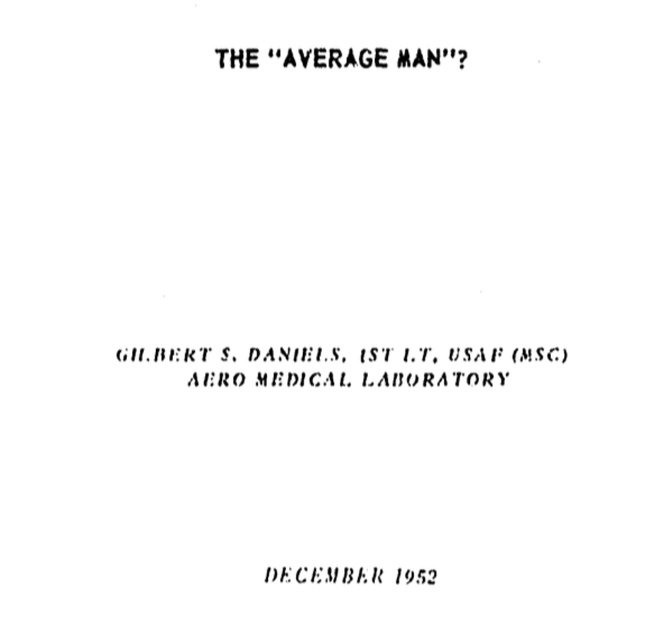
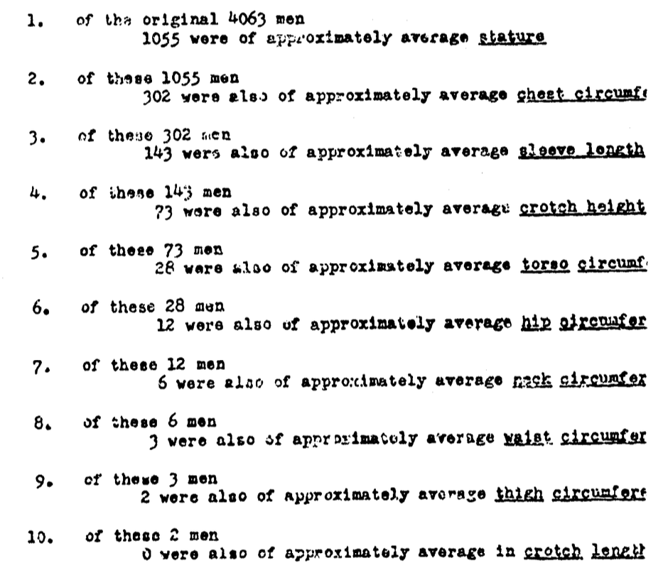
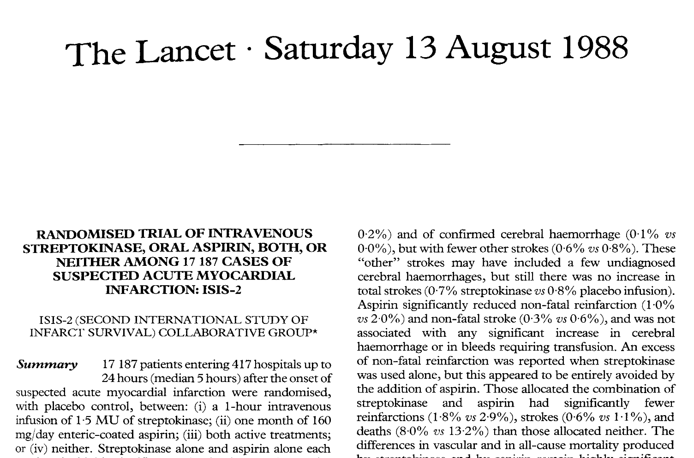
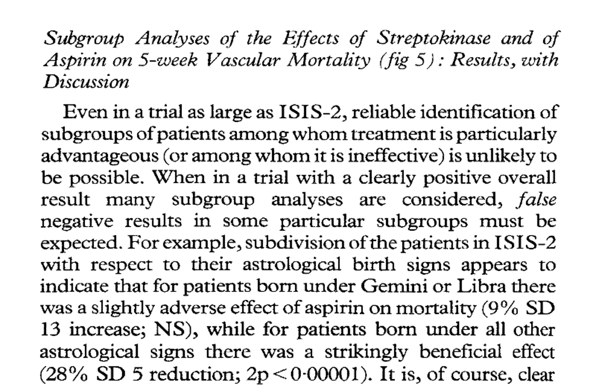
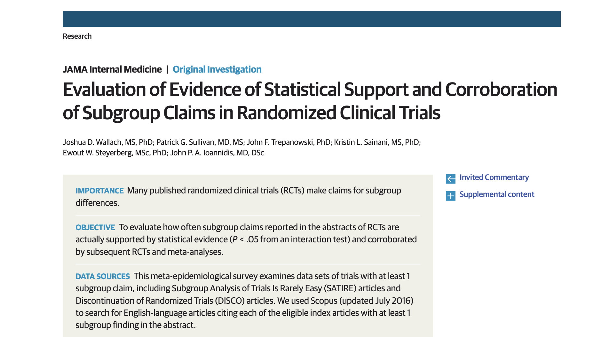
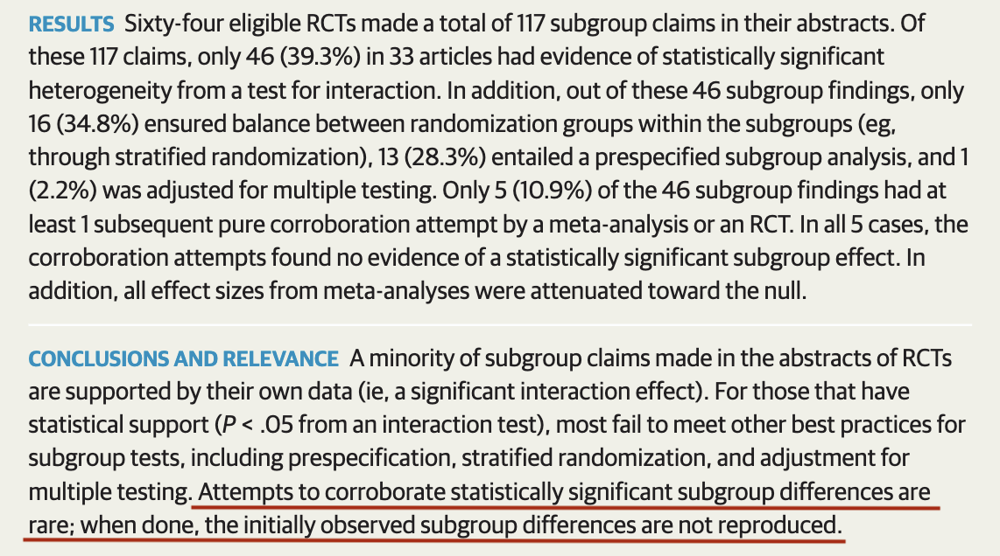
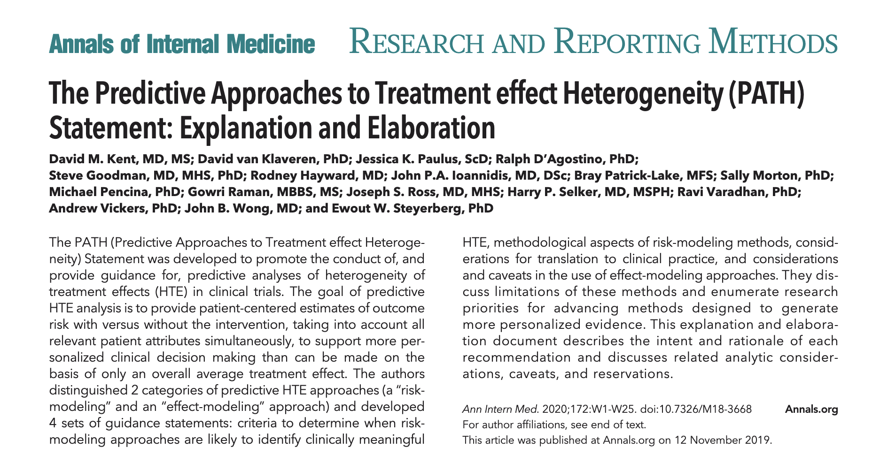
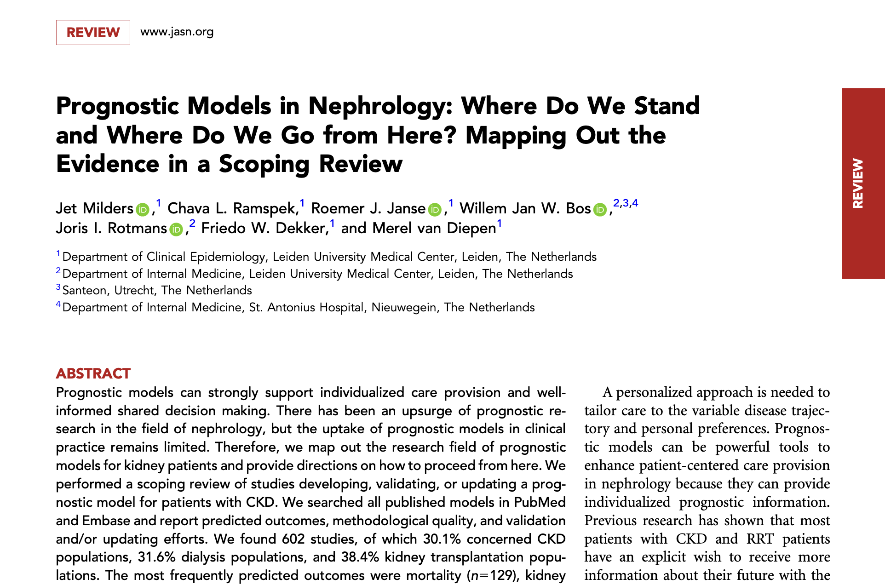

```{r set-up}
#| message: false
#| warning: false
#| include: false

# Load packages
pacman::p_load("dplyr",          # Data wrangling
               "tibble",         # Better data frames
               "magrittr",       # Better pipelines
               "tidyr",          # Data pivoting
               "purrr",          # Functional programming
               "survival",       # Survival data and functions
               "ggplot2",        # Data visualisation
               "patchwork",      # Patch plots together
               "conflicted"      # Package conflicts
)

# Resolve conflicts
conflicts_prefer(dplyr::filter)   # Between stats and dplyr

# Theme for plots
theme_manual <- function(){
    theme(panel.border = element_rect(fill = "transparent",
                                      colour = "black"),
          panel.grid = element_blank(),
          panel.background = element_rect(fill = "white"),
          plot.background = element_rect(fill = "white",
                                         colour = "white"))
}

# Theme for histograms
theme_manual_hist <- function(){
    theme(panel.border = element_rect(fill = "transparent",
                                      colour = NA),
          panel.grid = element_blank(),
          panel.background = element_rect(fill = "white"),
          plot.background = element_rect(fill = "white",
                                         colour = "white"),
          axis.line.x = element_line(),
          axis.title.y = element_blank(),
          axis.ticks.y = element_blank(),
          axis.text.y = element_blank())
}

# Prepare colon data from {survival}
dat <- colon %>%
    # Keep only entry for death outcome
    filter(etype == 2) %>%
    # Drop levamisole alone
    filter(rx != "Lev") %>%
    # Clean up variables
    mutate(# Binary treatment indicator
           trt = if_else(rx == "Obs", 0, 1),
           # Rename status
           death = status,
           # Sex to female
           female = if_else(sex == 1, 0, 1),
           ## Impute mean (we only we take this easy yet flawed approach for educational purposes)
           differ = as.factor(if_else(is.na(differ), round(mean(differ, na.rm = TRUE)), differ)),
           nodes = if_else(is.na(nodes), round(mean(nodes, na.rm = TRUE)), nodes)) %>%
    # Set to tibble
    as_tibble() %>%
    # Keep only relevant variables
    select(id, trt, female, age, obstruct, perfor, adhere, nodes, differ, time, death)

```

# Prelude

## The "Average Man"?
{fig-align="center"}

## The "Average Man"?
{fig-align="center"}

## The "Average Man"?
{fig-align="center"}

## The "Average Man"?
{fig-align="center"}

## Academia’s mythical average individual{.smaller}

*Causal aim:*

- What is the effect of intervention $A=1$ compared to intervention $A=0$ on outcome $Y^a$?

:::{.fragment}
```{mermaid RCT-0}
%%| fig-align: center

flowchart TB
    rct("Randomised controlled trial")
```
:::

## Academia’s mythical average individual{.smaller}

*Causal aim:*

- What is the effect of intervention $A=1$ compared to intervention $A=0$ on outcome $Y^a$?

```{mermaid RCT-1}
%%| fig-align: center

flowchart TB
    rct("Randomised controlled trial") --> ma["Main analysis"]
```

## Academia’s mythical average individual{.smaller}

*Causal aim:*

- What is the effect of intervention $A=1$ compared to intervention $A=0$ on outcome $Y^a$?

```{mermaid RCT-2}
%%| fig-align: center

flowchart TB
    rct("Randomised controlled trial") --> ma["Main analysis"]
    ma --> ate(["Average treatment effect (ATE)"])
```

## Academia’s mythical average individual{.smaller}

*Causal aim:*

- What is the effect of intervention $A=1$ compared to intervention $A=0$ on outcome $Y^a$?

```{mermaid RCT-3}
%%| fig-align: center

flowchart TB
    rct("Randomised controlled trial") --> ma["Main analysis"]
    ma --> ate(["Average treatment effect (ATE)"])
```

## Academia’s mythical average individual{.smaller}

*Causal aim:*

- What is the effect of intervention $A=1$ compared to intervention $A=0$ on outcome $Y^a$?

```{mermaid RCT-4}
%%| fig-align: center

flowchart TB
    rct("Randomised controlled trial") --> ma["Main analysis"]
    ma --> ate(["Average treatment effect (ATE)"])
    ate --> pop("Population")
```

## Academia’s mythical average individual{.smaller}

*Causal aim:*

- What is the effect of intervention $A=1$ compared to intervention $A=0$ on outcome $Y^a$?

```{mermaid RCT-5}
%%| fig-align: center

flowchart TB
    rct("Randomised controlled trial") --> ma["Main analysis"]
    ma --> ate(["Average treatment effect (ATE)"])
    ate --> pop("Population")
    rct --> sa["Subgroup analysis"]
```

## Academia’s mythical average individual{.smaller}

*Causal aim:*

- What is the effect of intervention $A=1$ compared to intervention $A=0$ on outcome $Y^a$?

```{mermaid RCT-6}
%%| fig-align: center

flowchart TB
    rct("Randomised controlled trial") --> ma["Main analysis"]
    ma --> ate(["Average treatment effect (ATE)"])
    ate --> pop("Population")
    rct --> sa["Subgroup analysis"]
    sa --> cate(["Conditional average <br> treatment effect (CATE)"])
    
```

## Academia’s mythical average individual{.smaller}

*Causal aim:*

- What is the effect of intervention $A=1$ compared to intervention $A=0$ on outcome $Y^a$?

```{mermaid RCT-7}
%%| fig-align: center

flowchart TB
    rct("Randomised controlled trial") --> ma["Main analysis"]
    ma --> ate(["Average treatment effect (ATE)"])
    ate --> pop("Population")
    rct --> sa["Subgroup analysis"]
    sa --> cate(["Conditional average <br> treatment effect (CATE)"])
    cate --> subpop("Subgroups in population")
    
```

## Academia’s mythical average individual{.smaller}

*Causal aim:*

- What is the effect of intervention $A=1$ compared to intervention $A=0$ on outcome $Y^a$?

```{mermaid RCT-8}
%%| fig-align: center

flowchart TB
    rct("Randomised controlled trial") --> ma["Main analysis"]
    ma --> ate(["Average treatment effect (ATE)"])
    ate --> pop("Population")
    rct --> sa["Subgroup analysis"]
    sa --> cate(["Conditional average <br> treatment effect (CATE)"])
    cate --> subpop("Subgroups in population")
    rct --> path["Risk/effect modelling"]
    
```

## Academia’s mythical average individual{.smaller}

*Causal aim:*

- What is the effect of intervention $A=1$ compared to intervention $A=0$ on outcome $Y^a$?

```{mermaid RCT-9}
%%| fig-align: center

flowchart TB
    rct("Randomised controlled trial") --> ma["Main analysis"]
    ma --> ate(["Average treatment effect (ATE)"])
    ate --> pop("Population")
    rct --> sa["Subgroup analysis"]
    sa --> cate(["Conditional average <br> treatment effect (CATE)"])
    cate --> subpop("Subgroups in population")
    rct --> path["Risk/effect modelling"]
    path --> ite(["Individualised treatment <br> effect (ITE)"])
    
```

## Academia’s mythical average individual{.smaller}

*Causal aim:*

- What is the effect of intervention $A=1$ compared to intervention $A=0$ on outcome $Y^a$?

```{mermaid RCT-10}
%%| fig-align: center

flowchart TB
    rct("Randomised controlled trial") --> ma["Main analysis"]
    ma --> ate(["Average treatment effect (ATE)"])
    ate --> pop("Population")
    rct --> sa["Subgroup analysis"]
    sa --> cate(["Conditional average <br> treatment effect (CATE)"])
    cate --> subpop("Subgroups in population")
    rct --> path["Risk/effect modelling"]
    path --> ite(["Individualised treatment <br> effect (ITE)"])
    ite --> ind("Individual people")
    
```

## Estimands: ATE{.smaller}

**Average treatment effect:** 
$$\mathbb{E}[Y^{a=1}] - \mathbb{E}[Y^{a=0}]$$

:::{.fragment}
Useful for:

- Policy makers
:::

:::{.fragment}
RCTs are powered to estimate the ATE.
:::

## Estimands: CATE{.smaller}

**Conditional average treatment effect:** 
$$\mathbb{E}[Y^{a=1}|X] - \mathbb{E}[Y^{a=0}|X]$$


:::{.fragment}
Useful for:

- Policy makers
- Healthcare providers
:::

:::{.fragment}
RCTs are rarely powered to estimate a CATE.
:::

## Estimands: CATE{.smaller}


## Estimands: CATE{.smaller}


## Estimands: CATE{.smaller}


## Estimands: CATE{.smaller}


## Estimands: ITE{.smaller}

**Individualised treatment effect:**\
[(*really just a CATE*)]{font-size=0.75em}
$$\mathbb{E}[Y^{a=1}|X_1,X_2...X_p] - \mathbb{E}[Y^{a=0}|X_1,X_2...X_p]$$

:::{.fragment}
Useful for:

- Healthcare providers
:::

:::{.fragment}
RCTs are not powered to estimate an ITE
:::

## Estimands{.smaller}

```{mermaid estimands-1}
%%| fig-align: center

flowchart TB
    rct("Randomised controlled trial <br> (RCT)") --> ma["Main analysis"]
    ma --> ate(["Average treatment effect (ATE)"])
    ate --> pop("Population")
    rct --> sa["Subgroup analysis"]
    sa --> cate(["Conditional average <br> treatment effect (CATE)"])
    cate --> subpop("Subgroups in population")
    rct --> path["Risk/effect modelling"]
    path --> ite(["Individualised treatment <br> effect (ITE)"])
    ite --> ind("Individual people")
    
```

## Estimands{.smaller}

```{mermaid estimands-2}
%%| fig-align: center

flowchart TB
    rct("Randomised controlled trial <br> (RCT)") --> ma["Main analysis"]
    ma --> ate(["Average treatment effect (ATE)"])
    ate --> pop("Population")
    rct --> sa["Subgroup analysis"]
    sa --> cate(["Conditional average <br> treatment effect (CATE)"])
    cate --> subpop("Subgroups in population")
    rct --> path["Risk/effect modelling"]
    path --> ite(["Individualised treatment <br> effect (ITE)"])
    ite --> ind("Individual people")
    
%% Custom style for node CATE and ITE
style cate fill:#F9A03F,stroke:#C36F09
style ite fill:#E79E9C,stroke:#6F1D1B
    
```

## Estimands{.smaller}

```{mermaid estimands-3}
%%| fig-align: center

flowchart TB
    rct("Pooled RCTs/ <br> Observational study") --> ma["Main analysis"]
    ma --> ate(["Average treatment effect (ATE)"])
    ate --> pop("Population")
    rct --> sa["Subgroup analysis"]
    sa --> cate(["Conditional average <br> treatment effect (CATE)"])
    cate --> subpop("Subgroups in population")
    rct --> path["Risk/effect modelling"]
    path --> ite(["Individualised treatment <br> effect (ITE)"])
    ite --> ind("Individual people")
    
```

## Treatment effect heterogeneity{.smaller}
:::{.incremental}
- The CATE/ITE can differ for specific subgroups/individuals
- This is of interest if they differ in *magnitude* or *direction*
- The presence of such differences is called **treatment effect heterogeneity / heterogeneity in treatment effects (HTE)**
- Clinically relevant HTE occurs when the differences cross a clinically relevant threshold
- Clinically relevant HTe is generally measured on the absolute scale
:::

## Treatment effect heterogeneity{.smaller}
We should note the scale of HTE: relative homogeneity may still give absolute heterogeneity:

:::{.fragment}
```{r scales}
# Risk and odds ratio's under study
sizes <- seq(0.5, 0.9, 0.1)

# Initial data frame with baseline risks
dat_rm <- tibble(baseline_risk = seq(0, 1, 0.01)) 

# Calculate ARRs
dat_arr <- bind_rows(
  # Risk ratios
  map(sizes, \(x){
    # Calculate ARR for risk ratio
    dat_rm %>%
      # Calculate ARR
      mutate(arr = baseline_risk - baseline_risk * x,
             # Add indicator for effect measure
             em = "rr",
             # Add indicator for effect size
             size = x)
  }),
  # Odds ratios
  map(sizes, \(x){
    # Calculate ARR for odds ratio
    dat_rm %>%
      # Calculate ARR
      mutate(# Calculate risk ratio from odds ratio
             rr = x / (1 - baseline_risk + (baseline_risk * x)),
             # Calculate ARR
             arr = baseline_risk - baseline_risk * rr,
             # Add indicator for effect measure
             em = "or",
             # Add indicator for effect size
             size = x) %>%
          # Drop risk ratio column
          select(-rr)
  }),
  # Hazard ratios
  map(sizes, \(x){
      # Calculate ARR for hazard ratio
      dat_rm %>%
          # Calculate ARR
          mutate(# Calculate interventional risk
                 intervention_survival_pr = (1 - baseline_risk) ^ x,
                 # Calculate ARR
                 arr = baseline_risk - (1 - intervention_survival_pr),
                 # Add indicator for effect measure
                 em = "hr",
                 # Add indicator for effect size
                 size = x) %>%
          # Drop intervention_risk column
          select(-intervention_survival_pr)
  })
) %>%
  # Set variables to factor
  mutate(# Effect estiamte
         em = factor(em,
                     levels = c("rr", "or", "hr"),
                     labels = c("Risk ratio", "Odds ratio", "Hazard ratio")),
         size = factor(format(size, nsmall = 2)))

# Create figure
ggplot(dat_arr,
       aes(x = baseline_risk,
           y = arr,
           colour = size,
           linetype = size)) +
  # Geometries
  geom_line() +
  # Scalings
  scale_x_continuous(name = "Baseline risk",
                     breaks = seq(0, 1, 0.2),
                     labels = paste0(seq(0, 100, 20), "%")) +
  scale_y_continuous(name = "Absolute risk reduction",
                     breaks = seq(0, 0.5, 0.1),
                     labels = paste0(seq(0, 50, 10), "%"),
                     expand = c(0, 0)) +
  scale_colour_manual(values = c("#648FFF", "#785EF0", "#DC267F", "#FE6100", "#FFB000")) +
  # Labels & guides
  guides(colour = guide_legend(position = "bottom",
                               title = "Effect size"),
         linetype = guide_legend(position = "bottom",
                                 title = "Effect size")) +
  # Transformations
  facet_wrap(vars(em)) +
  # Aesthetics
  theme_manual() +
  theme(strip.text = element_text(face = "bold"),
        strip.background = element_blank())
```
:::

## Treatment effect heterogeneity{.smaller}
:::{.incremental}
- One way to investigate and estimate HTE is through prediction modelling 
- Corresponding methodology is summarised in the Predictive Approaches to Treatment effect Heterogeneity (PATH) statement
:::

:::{.fragment}
{height=400px fig-align="center"}
:::

# The PATH statement
[(and more)]{font-size=0.75em}

## PATH approaches{.smaller}
:::{.incremental}
- Risk modelling <br> *Incorporate individual baseline risk ($E$) into analyses*
- Effect modelling <br> *Directly estimate individualised treatment effect*
:::

## Risk modelling{.smaller}

**General concept:** Incorporate individual baseline risk ($E$) into analyses

:::{.incremental}
- Method 1: add treatment-risk interaction to outcome model ($\mathbb{E}[Y^{a,e}]$) <br> *This gives an indication of the statistical presence of HTE on the relative scale*
- Method 2: perform analyses in risk-based subgroups ($\mathbb{E}[Y^a|E]$) <br> *This gives the CATE based on strata of predicted baseline risk*
:::

::::{.fragment}
:::{.callout-important}
When performing subgroup analyses, ensure that exchangeability holds
:::
::::

## Risk modelling: Baseline risk{.smaller}
How to estimate the individual baseline risk?

::::{.fragment}
Their baseline risk is their conditional probability of the outcome ($Pr(Y|X_1,X_2,...X_p)$) and can be estimated using an:

:::{.incremental}
- internal model (developed within the study data)
- external model (developed in external data)
:::
::::

::::{.fragment}
:::{.callout-important}
Internal models should be developed in the population not receiving the treatment of interest
:::
::::

## Risk modelling: Baseline risk{.smaller}
External models are available in abundance:



## Risk modelling: Baseline risk{.smaller}
Regardless of the model used:

:::{.incremental}
- validate it in your own data <br> *Is your identification/CATE valid in your population?*
- validate it in your target population <br> *Can you transfer your estimates to your target population?*
:::

## Effect modelling{.smaller}

**General concept:** Directly estimate individualised treatment effect

::::{.fragment}
In case exchangeability holds:

:::{.incremental}
- Each individual contributes to estimation in their factually assigned treatment arm
- Given exchangeability, we may use differently assigned individuals to consider an individual's counterfactual situation if they were assigned to the other treatment arm
- We can model the causal contrast between individuals with contrasting treatment arms, conditional on a sufficient set of individual predictors $\textbf{X}$ ($\textbf{X} = X_1,X_2...X_p$)
- Given $\textbf{X}$, this causal contrast reflects the individual benefit (a.k.a. the individualised treatment effect)
- Ideally, benefit is estimated on the absolute scale, e.g. the absolute risk difference (ARD)
:::
::::

## Effect modelling{.smaller}
Several techniques for effect modelling exist:

:::{.incremental}
- S-learner
- T-learner
- X-learner
- DR-learner
- R-learner
- Causal forest
:::

## S-learners{.smaller}
S-learners are the simplest method, as they rely on only a single model:

:::{.incremental}
- We aim to estimate the ARD, as estimand for individual benefit
- We express this as $ARD = AR_{A=1} - AR_{A=0}$, where $AR_{A=1} = \mathbb{E}[Y=1|A=1,\textbf{X}]$ and $AR_{A=0} = \mathbb{E}[Y=1|A=0,\textbf{X}]$
- An S-learner means that we fit a single (S) model for both $AR_{A=1}$ and $AR_{A=0}$
- Thus, we fit the model $Y = \textit{f}(a + \beta_A * A + \textbf{X}\beta)$
- We then calculate benefit as $ARD = \textit{f}(a + \beta_A + \textbf{X}\beta) - \textit{f}(a + \textbf{X}\beta)$
:::

::::{.fragment}
:::{.callout-note}
$\textit{f}$ can be any model architecture we desire
:::
::::

## S-learners{.smaller}
An example using data from one of the first succesful trials of adjuvant chemotherapy in colon cancer (Levamisole + 5-FU vs. placebo) ^[Laurie *et al.* 1989 J Clinical Oncology]

```{r example_data}
dat
```

## S-learners{.smaller}
We also need a small function to get the outcome risk:
```{r ar_function}
#| echo: true
ar <- function(.data,         # Data with predictors
               trt_status,    # Hypothetical treatment status
               fit            # Model fit
){
    # Get linear predictor with hypothetical new data
    lp <- predict(fit, 
                  type = "lp", 
                  newdata = mutate(.data, trt = trt_status))
    
    # Get AR
    ar <- 1 - (exp(-last(basehaz(fit))[["hazard"]]) ^ exp(lp))

    # Return output
    return(ar)
}

```

## S-learners{.smaller auto-animate=true}

```{r slearner-1}
#| echo: true
# Fit model
fit_slearner <- coxph(Surv(time, death) ~ trt + age + female + obstruct + perfor + adhere + nodes + differ,
                      data = dat)

```

## S-learners{.smaller auto-animate=true}

```{r slearner-2}
#| echo: true
# Fit model
fit_slearner <- coxph(Surv(time, death) ~ trt + age + female + obstruct + perfor + adhere + nodes + differ,
                      data = dat)

# Estimate ARD
vec_ard <- ar(dat, 1, fit_slearner) - ar(dat, 0, fit_slearner)

```

:::{.fragment}
```{r slearner-hist}
# Visualise ARD
ggplot(tibble(vec_ard),
       aes(x = vec_ard)) +
    # Geometries
    geom_histogram(binwidth = 0.01,
                   colour = "#13540c",
                   fill = "#cde498") +
    # Scalings
    scale_x_continuous(name = "Absolute risk difference",
                       breaks = seq(-0.15, 0, 0.05),
                       labels = paste0(seq(-15, 0, 5), "%-point")) +
    scale_y_continuous(expand = expansion(mult = c(0, 0.05))) +
    # Aesthethics
    theme_manual_hist()

```
:::


## T-learners{.smaller}
T-learners instead use a single model per treatment arm. In our example, that would be two (T) models.

:::{.incremental}
- A T-learner means that we fit separate models for $AR_{A=1}$ and $AR_{A=0}$
- Thus, we fit the models <br> 
$Y_{A=1} = \textit{f}(a + \textbf{X}\beta)$; <br>
$Y_{A=0} = \textit{f}(a + \textbf{X}\beta)$
- We then calculate benefit as $ARD = Y_{A=1}(\textbf{X}) - Y_{A=0}(\textbf{X})$
:::

## T-learners{.smaller auto-animate=true}

```{r slearner-1}
#| echo: true
# Subset data
dat_a1 <- filter(dat, trt == 1)   # Treated population
dat_a0 <- filter(dat, trt == 0)   # Untreated population

```

## T-learners{.smaller auto-animate=true}

```{r slearner-1}
#| echo: true
# Subset data
dat_a1 <- filter(dat, trt == 1)   # Treated population
dat_a0 <- filter(dat, trt == 0)   # Untreated population

# Fit treated model
fit_tlearner_a1 <- coxph(Surv(time, death) ~ trt + age + female + obstruct + perfor + adhere + nodes + differ,
                         data = dat_a1)

# Fit untreated model
fit_tlearner_a0 <- coxph(Surv(time, death) ~ trt + age + female + obstruct + perfor + adhere + nodes + differ,
                         data = dat_a0)

```

## T-learners{.smaller auto-animate=true}

```{r slearner-2}
#| echo: true
# Subset data
dat_a1 <- filter(dat, trt == 1)   # Treated population
dat_a0 <- filter(dat, trt == 0)   # Untreated population

# Fit treated model
fit_tlearner_a1 <- coxph(Surv(time, death) ~ age + female + obstruct + perfor + adhere + nodes + differ,
                         data = dat_a1)

# Fit untreated model
fit_tlearner_a0 <- coxph(Surv(time, death) ~ age + female + obstruct + perfor + adhere + nodes + differ,
                         data = dat_a0)

# Estimate ARD
vec_ard <- ar(dat, NULL, fit_tlearner_a1) - ar(dat, NULL, fit_tlearner_a0)

```

:::{.fragment}
```{r slearner-hist}
# Visualise ARD
ggplot(tibble(vec_ard),
       aes(x = vec_ard)) +
    # Geometries
    geom_histogram(binwidth = 0.01,
                   colour = "#13540c",
                   fill = "#cde498") +
    # Scalings
    scale_x_continuous(name = "Absolute risk difference",
                       breaks = seq(-0.8, 0.2, 0.2),
                       labels = paste0(seq(-80, 20, 20), "%-point")) +
    scale_y_continuous(expand = expansion(mult = c(0, 0.05))) +
    # Aesthethics
    theme_manual_hist()

```
:::

# X-learner


