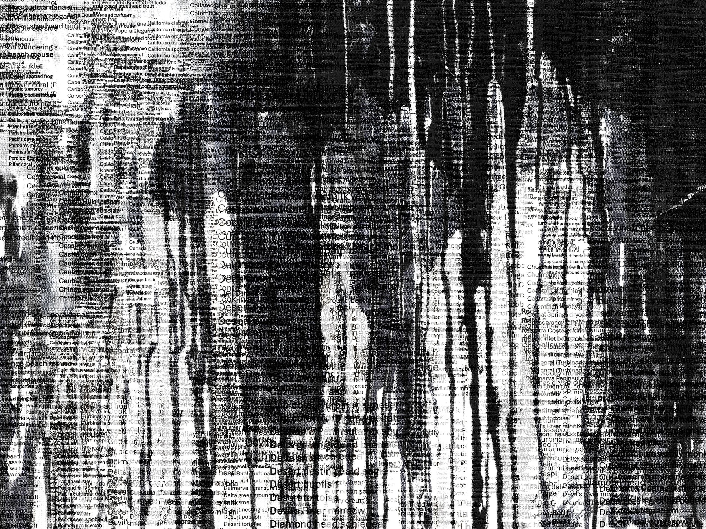

[Go back](https://rjjanse.github.io#oo)

---

::: {layout-ncol=3}

{target="_blank"}

[![P(robabilities), E[xpectations], and the Truth](images/probability.png)](https://rjjanse.github.io/talks/pet){target="_blank"}

{target="_blank"}

:::

