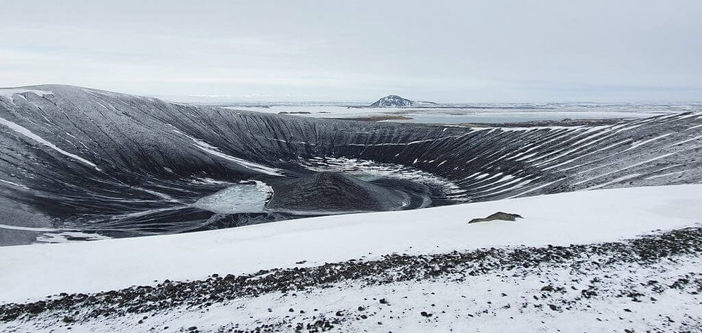

[Go back](https://rjjanse.github.io#oo)

---

::: {layout-ncol=3}

[{width=253px height=189.85px}](https://rjjanse.github.io/talks/modelling){target="_blank"}

[![P(robabilities), E[xpectations], and the Truth](images/probability.png){width=253px height=189.85px}](https://rjjanse.github.io/talks/pet){target="_blank"}

[{width=253px height=189.85px}](https://rjjanse.github.io/talks/figures){target="_blank"}

[{width=253px height=189.85px}](https://rjjanse.github.io/talks/pseudo-observations){target="_blank"}

:::

