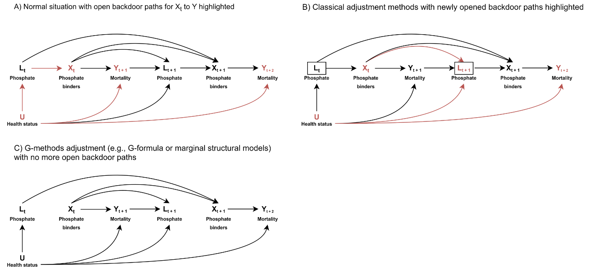
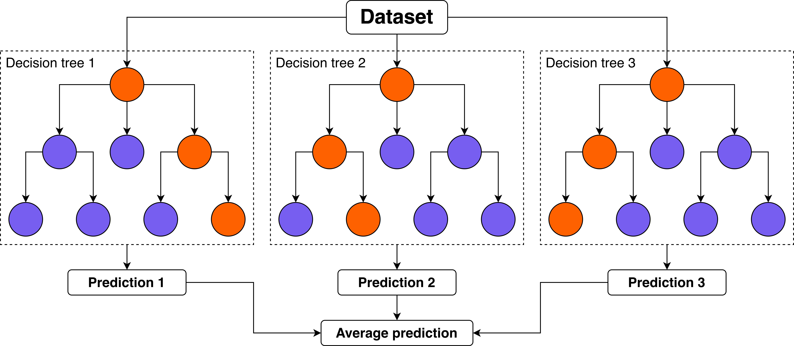
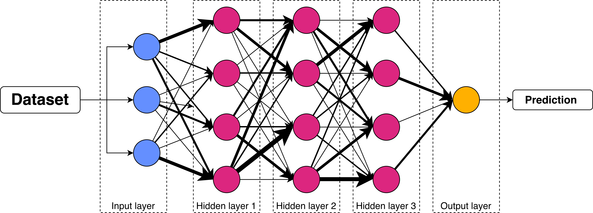
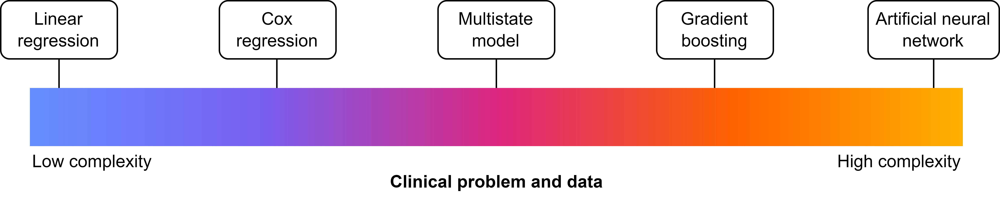

```{r set-up}
#| message: false
#| warning: false
#| include: false

# Load packages
pacman::p_load("conflicted",     # Package conflicts
               "dplyr",          # Data wrangling
               "magrittr",       # Better pipelines
               "tidyr",          # Data pivoting
               "ggplot2",        # Data visualisation
               "patchwork"       # Patch plots together
)

# Resolve conflicts
conflicts_prefer(dplyr::filter)   # Between stats and dplyr

```

# Disclaimer
Depending on who you ask, this talk is about:

:::{.incremental}
- Epidemiology
- Data science / analytics
- Machine learning / Artificial intelligence
:::

:::{.fragment}
These are generally the same, but differ in the terminology used for the same concepts, certain convictions, and approaches.
:::

## Agenda
- Tests are Void in the Presence of Models
- Digression: The Three Pillars of Research with Data
- What Makes a Model?
- Making a Model
- Modelling in Practice

# Tests are Void in the Presence of Models

## What is a Test?
:::{.incremental}
- Statistical tests are tools made for hypothesis testing.

- They yield the p-value, but do not say anything about direction or size.
:::

:::: {.fragment}
Examples are:

- T-test
- Chi-square test
- Fisher's exact test
:::

## What is a Model? 
::::{.r-fit-text}
:::{.incremental}
- Statistical models are mathematical models that summarise the relationship between different variables

- This relationship is quantified and can be used for a plethora of goals beyond hypothesis testing.
:::

:::{.fragment}
Statistical tests are just simple statistical models:

Statistical test|Equivalent statistical model
-|-
One-sample t-test|Intercept-only linear regression
Wilcoxon signed-rank test|Ranked univariable linear regression
Two-sample t-test|Univariable linear regression
One-way ANOVA|Multivariable linear regression
Chi-square test|Univariable logistic regression w/ dichotomous independent variable

More at [Jonas Kristoffer Lindeløv's GitHub](https://lindeloev.github.io/tests-as-linear/)
:::
::::

## Models > Tests
Models allow us to:

:::{.incremental}
- Model more explicitly
- Model more flexibly
- Derive more information from our data
:::

# Digression: The Three Pillars of Research with Data
## What is our Aim?
*Descriptive:*\
Describe some situation, such as the prevalence of a disease, or how two variables relate to each other.\
\

:::{.fragment}
*Causal/etiological:*\
Determine whether some factor A causes some event B\
:::
\

:::{.fragment}
*Predictive (diagnostic & prognostic):*\
Predict the presence/future occurrence of some event or present/future value of some measurement.
:::

## What is our Aim?
These are often conflated!\
[Ramspek CL, *et al.* Prediction or causality? A scoping review of their conflation within current observational research. Eur J Epidemiol. 2021](https://doi.org/10.1007/s10654-021-00794-w)\
\

::::{.fragment}
This is problematic because, these different pillars require:

:::{.incremental}
- different use of the same models
- different interpretation of the same models
- different parts of the same models' output
:::
::::

# What Makes a Model?
## Information that Represents the Situation
We want our models to accurately represent some situation

:::{.incremental}
- Descriptive: occurrence of a factor in the population of interest
- Causal: different groups which only differ on intervention status
- Predictive: probability of occurrence/expected value in population of interest
:::

:::{.fragment}
To achieve this, we need to fill our model with data: covariates & parameters.
:::

## Covariates
Covariates are variables (e.g. age, sex, eGFR) that we add to the model to represent our situation of interest:

:::{.incremental}
- Descriptive: none
- Causal: intervention status + confounders
- Predictive: predictors
:::

## Covariates
The way we select these covariates is important.

:::{.incremental}
- Knowledge-based: use (y)our clinical knowledge and causal graphs
- Data-driven: automatically select based on the data
:::

## Covariates: knowledge-based selection
For causal & prediction research

:::{.incremental}
- Predictive: what are likely predictors & what increases face validity
- Causal: what are possible confounders?
:::

## Covariates: knowledge-based selection
For confounder selection: use DAGs\
\

::::{.fragment}
*Directed acyclic graph (DAG):*

:::{.incremental}
- Shows relation between different variables
- Helps select the minimal relevant set of confounders (!)
- Helps avoid inducing selection bias
:::
::::

## Covariates: knowledge-based selection


## Covariates: knowledge-based selection
Two important lessons that DAGs teach us:

:::{.incremental}
- We do not need to adjust for all confounders
- Selection is not selection bias *per sé* 
:::

:::{.fragment}
A proper introduction to DAGs:\
[Feeney T, *et al.* How to use directed acyclic graphs: guide for clinical researchers. BMJ. 2025](https://doi.org/10.1136/bmj-2023-078226) & [Hernán MA, *et al.* A structural approach to selection bias. Epidemiology. 2004](https://doi.org/10.1097/01.ede.0000135174.63482.43)
:::

## Covariates: data-driven selection:
Only for prediction research\
\

:::{.fragment}
Have the data select the most predictive variables (from a set of candidate predictors) through:\
:::

:::{.fragment}
*From worse to better:*

- Univariable selection
- Forward selection
- Backward selection
- Penalised likelihood estimation (LASSO / L1 regularisation / elastic net regression)
:::

## Covariates: data-driven selection:
Core idea: based on some measure, determine which variables aid prediction and which do not

::::{.r-fit-text}
:::{.incremental}
- Univariable selection: p-value (often < 0.05, < 0.10, or < 0.178)
- Forward selection: start with one candidate predictor and then, per iteration, add new candidate predictor, keep that variable only if p-value is significant or LRT/AIC/BIC improves
- Backward selection: start with all candidate predictors and then per iteration, drop predictor based on worst p-value / test statistic
- Penalised likelihood estimation: start with all candidate predictors; the model may drop variables if they add very little value (MLE)
:::
::::

## Covariates: data-driven selection
**Overfitting:** the prediction model has incorporated patterns that are coincidentally present in the development data, but not in the target population\
\

:::{.fragment}
**Result:** model performance is worse in reality than observed during development
:::

## Covariates: data-driven selection
```{r overfitting}
#| warning: FALSE

# Set seed for random process
set.seed(1)

# Create data
dat <- 
    # Data with independent variable
    tibble(x = 1:100) %>%
    # Dependent variable is exponential
    mutate(y = 1.1 ^ (x / 2),
           # Jitter y
           y = jitter(y, amount = 5))

## Create plots
# Underfitting
p_uf <- ggplot(dat,
               aes(x = x,
                   y = y)) +
    # Geometries
    geom_point() +
    geom_smooth(method = "lm",
                formula = "y ~ x",
                se = FALSE,
                colour = "#785EF0") +
    # Labels
    ggtitle("Underfitting") +
    xlab("Prediction") +
    ylab("Outcome") +
    # Aesthetics
    theme(plot.title = element_text(face = "bold",
                                    hjust = 0.5),
          panel.background = element_blank(),
          panel.grid = element_blank(),
          axis.line = element_line(),
          axis.text = element_blank())
          
# Goodfitting
p_gf <- ggplot(dat,
               aes(x = x,
                   y = y)) +
    # Geometries
    geom_point() +
    geom_smooth(method = "loess",
                formula = "y ~ x",
                se = FALSE,
                colour = "#785EF0") +
    # Labels
    ggtitle("Goodfitting") +
    xlab("Prediction") +
    ylab("Outcome") +
    # Aesthetics
    theme(plot.title = element_text(face = "bold",
                                    hjust = 0.5),
          panel.background = element_blank(),
          panel.grid = element_blank(),
          axis.line = element_line(),
          axis.text = element_blank())

# Overfitting
p_of <- ggplot(dat,
               aes(x = x,
                   y = y)) +
    # Geometries
    geom_point() +
    geom_smooth(method = "loess",
                formula = "y ~ x",
                span = 0.05,
                se = FALSE,
                colour = "#785EF0") +
    # Labels
    ggtitle("Overfitting") +
    xlab("Prediction") +
    ylab("Outcome") +
    # Aesthetics
    theme(plot.title = element_text(face = "bold",
                                    hjust = 0.5),
          panel.background = element_blank(),
          panel.grid = element_blank(),
          axis.line = element_line(),
          axis.text = element_blank())

# Wrap plots for output
wrap_plots(p_uf, p_gf, p_of,
           nrow = 1)

```

## (Hyper)parameters
Some models require additional parameters (also called hyperparameters) that need to be decided:

- Generalised linear model: link function
- LASSO/ridge/elastic net regression: $\lambda$
- Random forest: nr. of trees & tree depth
- Neural network: nr. of hidden layers

Some of these are determined based on knowledge (e.g. link function), some of these are determined through 'tuning' (risk of overfitting!)

## (Hyper)parameters
Sometimes, we may also add weights as an additional parameter to models.\
\

::::{.fragment}
Weights result in observations being counted more or less frequently than once.

:::{.incremental{
- Descriptive: represent the total population based on a skewed sample (e.g. LUMC NEO study)
- Causal: adjust for confounding by creating a pseudopopulation in which it does not exist
:::
::::

# Making a Model
## Parametric vs. non-parametric models
Most of our models summarise our data to the model output. For instance:

:::{.incremental}
- Most models contain an intercept (the uncoonditional probability $P(Y)$ or expected value $E[Y]$)
- Our covariates are given a coefficient (a.k.a. weight) by the model
:::

::::{.fragment}
:::{.callout-tip}
Giving a weight to a coefficient is also called the model learning the weight for that coefficient (or feature), hence the term machine learning
:::
::::

## Parametric vs. non-parametric models
Not all models are fully parametric:

- Cox regression model: baseline hazard is not parametricised
- K-nearest neighbour: fully non-parametric model

:::{.fragment}
This is relevant because:

- Parametrisation makes assumptions about the data
- No parametrisation requires the model to contain (part of) the underlying data
:::

## Model architectures
:::{.incremental}
- The type of model is mainly dictated by the architecture it uses
- The architecture is built-in, but adaptable through (hyper)parameters
:::
\

:::{.fragment}
The simplest architecture:
$y = ax + b$ (linear regression)
:::

## Model architectures
Say that $ax + b = X\beta$

::::{.fragment}
*Generalised linear model:*

:::{.incremental}
- $y = X\beta$ (linear regression)
- $y = \frac{1}{1 + e^{-X\beta}}$ (logistic regression)
- $y = e^{X\beta}$ (Poisson regression)
:::
::::

:::{.fragment}
*Cox regression:*\
$y(t) = 1 - S_0(t)^{e^{X\beta}}, S_0(t) = e^{-H_0(t)}$
:::

## Model architectures
*Random forest:*


## Model architectures
*Artificial neural network:*


## Model architectures
Now relating it to the pillars:

- Descriptive: simple architectures
- Causal: simple architectures
- Predictive: simple or complex architectures

:::{.fragment}

:::

## Model architectures
::::{.r-fit-text}
**Bias-variance trade-off**\
Bias: how predictions match the truth (i.e. good performance)\
Variance: how performance varies between settings

:::{.incremental}
- Complexer model: fits better, but has a higher risk of overfitting -> lower bias, higher variance
- Simpler model: fits worse, but has a lower risk of overfitting -> higher bias, lower variance
:::
::::

## Model architectures
::::{.r-fit-text}
**Machine learning vs. Statistics**\

:::{.fragment}
Machine learning = statistics
:::

:::{.fragment}
|Statistics|Machine learning|
|-|-|
|Predictor|Feature|
|Outcome|Label|
|Estimation|Learning|
|Development data|Training + validation data|
|Validation data|Test data|
|Contingency table|Confusion matrix|
:::

:::{.fragment}
More @ [Janse RJ, *et al.*. When the whole is greater than the sum of its parts: why machine learning and conventional statistics are complementary for predicting future health outcomes. Clin Kidney J. 2025](https://doi.org/10.1093/ckj/sfaf059) & [Finlayson SG, *et al.* Machine Learning and Statistics in Clinical Research Articles-Moving Past the False Dichotomy. JAMA Pediatr. 2023 May](https://doi.org/10.1001/jamapediatrics.2023.0034)
:::
::::

# Modelling in Practice
## How to Model
::::{.r-fit-text}
Use a programming language!
\

:::{.fragment}
**R:** free, built for statistics, easy to program and read, great tools for data visualisation, used in most of medical statistics\
Get started: [my tutorial 😁](https://rjjanse.github.io/rt)
:::

\

:::{.fragment}
**Python:** free, built for general purposes, good statistical support, easy to program and read, used in most of computer sciences\
Get started: [w3schools](https://www.w3schools.com/python/)
:::

\

:::{.fragment}
**Julia:** free, built for statistics, good statistical support, fast, relatively uncommon in use\
Get started: [JuliaLang](https://julialang.org/learning/)
:::
::::

## How (Preferably) not to Model
Do not use a syntax!
\

:::{.fragment}
**SPSS:** €410.65/year, built for statistics, easy point-and-click, inflexible, poor syntax system, unstable (in my experience).
:::

\

:::{.fragment}
**SAS:** €?/year, built for statistics, not so flexible, syntax-reliant, many companies are reliant on it
:::

\

:::{.fragment}
**STATA:** €150.32/year, built for statistics, not so flexible, syntax-reliant, many companies are reliant on it
:::

## How to Report on your Model
Models are only useful if we report on them.
\

:::{.fragment}
For all epidemiological studies: [STROBE](https://doi.org/10.1016/j.jclinepi.2007.11.008).
\
:::

:::{.fragment}
Also:

- **Descriptive:** [A Framework for Descriptive Epidemiology](https://doi.org/10.1093/aje/kwac115)
- **Causal:** [CONSORT](https://doi.org/10.1136/bmj-2024-081123) or [RECORD](https://doi.org/10.1371/journal.pmed.1001885) 
- **Predictive:** [STARD](https://doi.org/10.1136/bmj.h5527) or [TRIPOD+AI](https://doi.org/10.1136/bmj-2023-078378)
:::

:::{.fragment}
Make sure to check the [Equator network](https://www.equator-network.org/) for more!
:::

## Closing Remarks
:::{.incremental}
- Always think about whether your study is descriptive, causal, or predictive
- Let that choice influence your modelling decisions
- Report on your model
:::

## The End
Contact me: [r.j.janse-5@umcutrecht.nl](mailto:r.j.janse-5@umcutrecht.nl)\
\

More about me: [rjjanse.github.io](https://rjjanse.github.io)\
\

These slides: [rjjanse.github.io/talks/modelling](https://rjjanse.github.io/talks/modelling)\
\

:::{style="font-size: 0.5em;"}
Image for title slide by Environmental Graphiti:\
[350 Species at Risk from Climate Change](https://www.environmentalgraphiti.org/all-series/scenarios-for-reducing-emissions-x3ex9-6rfd9-7wr3z-ghgsp-3mpra-3shbx-22bch-gfmyr) \
© 2025 Environmental Graphiti® All rights reserved.
:::