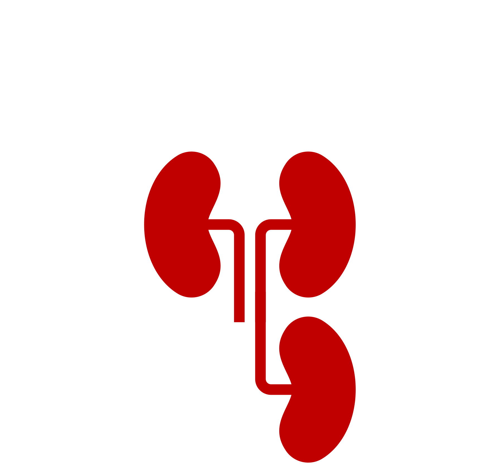
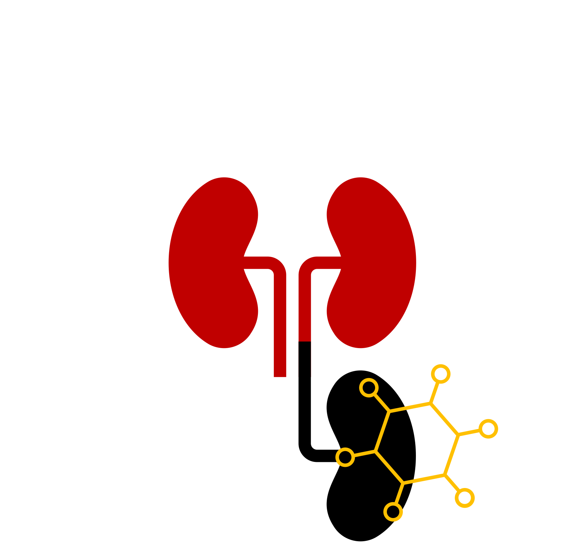
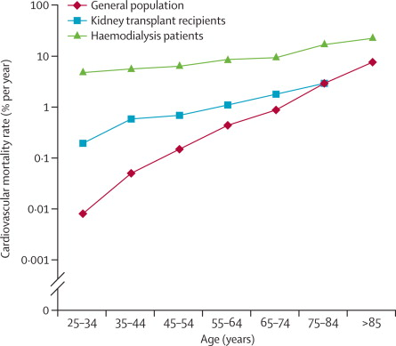
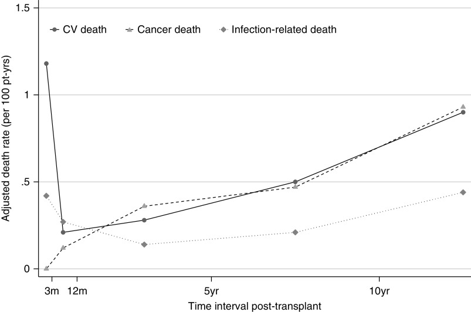
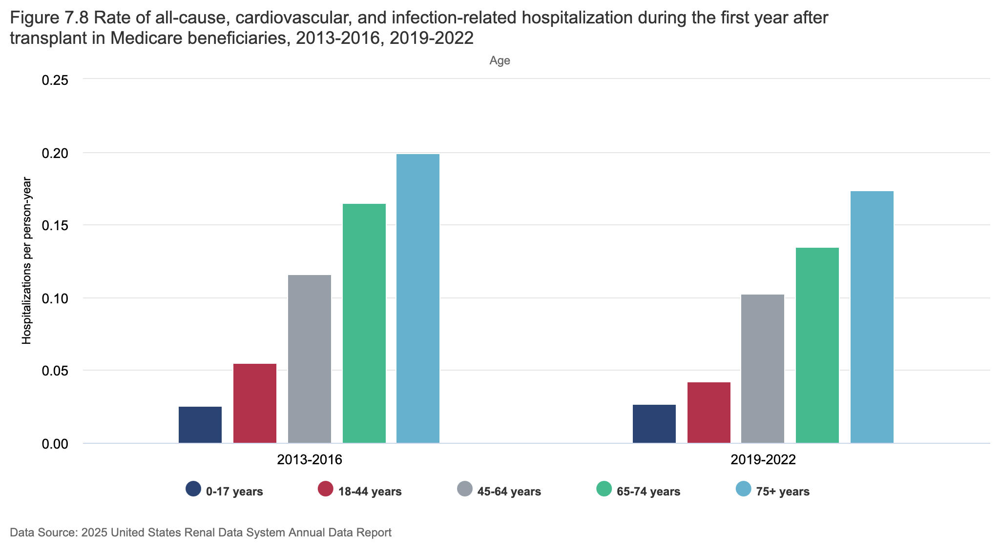
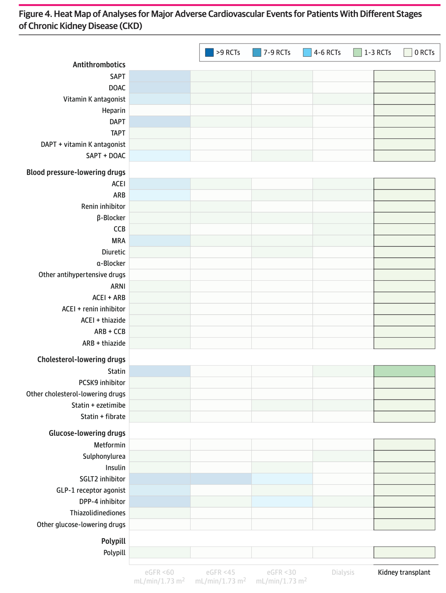

# Kidney transplantation and cardiovascular disease

## Post-KTx risks {.smaller} 
::::{.columns}

:::{.column width="50%"}

:::

:::{.column width="50%"}

:::
::::

## Post-KTx risks {.smaller} 
::::{.columns}

:::{.column width="50%"}

:::

:::{.column width="50%"}

:::
::::

## Post-KTx risks {.smaller} 
::::{.columns}

:::{.column width="50%"}

:::

:::{.column width="50%"}

:::
::::

## Post-KTx risks {.smaller} 
:::::{.columns}
::::{.column width="43%"}


:::aside
Jardine *et al.*, 2011 Lancet; DOI: [10.1016/s0140-6736(11)61334-2](https://doi.org/10.1016/s0140-6736(11)61334-2)
:::
::::

::::{.column width="57%"}
::::
:::::

## Post-KTx risks {.smaller} 
:::::{.columns}
::::{.column width="43%"}


:::aside
Jardine *et al.*, 2011 Lancet; DOI: [10.1016/s0140-6736(11)61334-2](https://doi.org/10.1016/s0140-6736(11)61334-2)
:::
::::

::::{.column width="57%"}


:::aside
Ying *et al.*, 2020 J Am Soc Nephrol; DOI: [10.1681/ASN.2020050566](https://doi.org/10.1681/ASN.2020050566)
:::
::::
:::::

## Post-KTx risks {.smaller} 


:::aside
Johansen *et al.*, 2026, Am J Kidney Dis; DOI: [10.1053/j.ajkd.2026.02.635](https://doi.org/10.1053/j.ajkd.2026.02.635) 
:::

## Cardiovascular prevention{.smaller}

|Risk factor|
|-|
|Hypertension^a,b^|
|Diabetes mellitus^a,b^|
|Smoking|
|Dyslipidaemia^a,b^|
|Obesity^a^|

:::aside
^a^ Exacerbated by steroids <br>
^b^ Exacerbated by calcineurin inhibitors
:::

## Cardiovascular prevention{.smaller}

|Risk factor|Pharmaceutical treatment|
|-|--|
|Hypertension^a,b^|ACEis, ARBs, CCBs|
|Diabetes mellitus^a,b^|Metformin, SU derivates, SGLT2is, GLP1-RAs, Insulin|
|Smoking||
|Dyslipidaemia^a,b^|Statins|
|Obesity^a^|Metformin, GLP1-RAs|

:::aside
^a^ Exacerbated by steroids <br>
^b^ Exacerbated by calcineurin inhibitors
:::

## Underlying evidence{.smaller}

{height=500}


:::aside
Colombijn *et al.*, 2024 JAMA Netw Open; DOI: [10.1001/jamanetworkopen.2024.0427](https://doi.org/10.1001/jamanetworkopen.2024.0427)
:::

# RCTs for evidence-based medicine

## RCT-based evidence
```{mermaid RCT-1}
%%| fig-align: center

flowchart TB
    rct("Randomised controlled trial") 
```

## RCT-based evidence
```{mermaid RCT-2}
%%| fig-align: center

flowchart TB
    rct("Randomised controlled trial") --> ma["Main analysis"]
    
```

## RCT-based evidence
```{mermaid RCT-3}
%%| fig-align: center

flowchart TB
    rct("Randomised controlled trial") --> ma["Main analysis"]
    ma --> ate(["Average treatment effect (ATE)"])
    
```

## Average treatment effect{.smaller}
The *Average treatment effect (ATE)* is the average effect in the total population

:::{.incremental}
- The main analysis of our RCT on drug A vs. placebo yields a risk reduction of 20% for cardiovascular events
- If we prescribe drug A to this population, the **population** will experience 20% less cardiovascular events
- An **individual** may have a different risk reduction: 10%, 30%, -5%
- But the average of all those individuals will be 20%
- This is useful for people who treat populations (*policy makers*)
- This is less useful for people who treat individuals (*clinicians*)
:::

## RCT-based evidence
```{mermaid RCT-4}
%%| fig-align: center

flowchart TB
    rct("Randomised controlled trial") --> ma["Main analysis"]
    ma --> ate(["Average treatment effect (ATE)"])
    ate --> pop("Population")
    
```

## RCT-based evidence
```{mermaid RCT-5}
%%| fig-align: center

flowchart TB
    rct("Randomised controlled trial") --> ma["Main analysis"]
    ma --> ate(["Average treatment effect (ATE)"])
    ate --> pop("Population")
    rct --> sa["Subgroup analysis"]
    
```

## RCT-based evidence
```{mermaid RCT-6}
%%| fig-align: center

flowchart TB
    rct("Randomised controlled trial") --> ma["Main analysis"]
    ma --> ate(["Average treatment effect (ATE)"])
    ate --> pop("Population")
    rct --> sa["Subgroup analysis"]
    sa --> cate(["Conditional average <br> treatment effect (CATE)"])
    
```

## Conditional average treatment effect{.smaller}
The *conditional average treatment effect (CATE)* is the average treatment effect in a **subgroup** of the population

:::{.incremental}
- We perform a subgroup analysis on biological sex, which yields a risk reduction of 30% for women and 12% for men
- If we prescribe drug A to this population, the **population** will experience 20% less cardiovascular events
- But the **population of women** will experience 30% less cardiovascular events
- And the **population of men** will experience 12% less cardiovascular events
- An **individual woman** or an **individual man** may still have a different risk reduction: 10%, 30%, -5%
- This is slightly useful for people who treat populations (*policy makers*)
- This is slightly useful for people who treat individuals (*clinicians*)
:::

## Conditional average treatment effect{.smaller}


## Conditional average treatment effect{.smaller}


## Conditional average treatment effect{.smaller}


## Conditional average treatment effect{.smaller}


## RCT-based evidence
```{mermaid RCT-7}
%%| fig-align: center

flowchart TB
    rct("Randomised controlled trial") --> ma["Main analysis"]
    ma --> ate(["Average treatment effect (ATE)"])
    ate --> pop("Population")
    rct --> sa["Subgroup analysis"]
    sa --> cate(["Conditional average <br> treatment effect (CATE)"])

```

## RCT-based evidence
```{mermaid RCT-8}
%%| fig-align: center

flowchart TB
    rct("Randomised controlled trial") --> ma["Main analysis"]
    ma --> ate(["Average treatment effect (ATE)"])
    ate --> pop("Population")
    rct --> sa["Subgroup analysis"]
    sa --> cate(["Conditional average <br> treatment effect (CATE)"])
    cate --> subpop("Subgroups in population")

```

# Individualised treatment effects

## RCT-based evidence
```{mermaid RCT-9}
%%| fig-align: center

flowchart TB
    rct("Randomised controlled trial") --> ma["Main analysis"]
    ma --> ate(["Average treatment effect (ATE)"])
    ate --> pop("Population")
    rct --> sa["Subgroup analysis"]
    sa --> cate(["Conditional average <br> treatment effect (CATE)"])
    cate --> subpop("Subgroups in population")
    rct --> magic["?"]

```

## RCT-based evidence
```{mermaid RCT-10}
%%| fig-align: center

flowchart TB
    rct("Randomised controlled trial") --> ma["Main analysis"]
    ma --> ate(["Average treatment effect (ATE)"])
    ate --> pop("Population")
    rct --> sa["Subgroup analysis"]
    sa --> cate(["Conditional average <br> treatment effect (CATE)"])
    cate --> subpop("Subgroups in population")
    rct --> magic["?"]
    magic --> ite(["Individual treatment effect"])

```

## Individual treatment effect{.smaller}
The *individual treatment effect* is the treatment effect for an individual

:::{.incremental}
- We assign drug A to an individual
- We open an alternative universe where everything is exactly the same, but we do not assign drug A to that individual
- The difference in their outcomes is the individual treatment effect
:::

## Individualised treatment effect{.smaller}
The *individualised treatment effect (ITE)* is a highly specific conditional treatment effect

:::{.incremental}
- We calculate the effect (CATE) based on many variables at once
- The CATE becomes so specific, that we consider it **individualised**
- For instance, drug A will give a 53-year old woman with diabetes, no cardiovascular history, a kidney function of 55 mL/min/1.73m^2^, with an increased lymphocyte count and who is using tacrolimus, mycophenolate, and basiliximab, as well as a renin-angiotensin-system inhibitor, a risk-reduction of 35%
- This is useful for people who treat individuals (*clinicians*)
:::

## Individualised treatment effect{.smaller}
To calculate the ITE, we can use two methods:

:::{fragment}
**Risk modelling:** <br>
- Using a (valid) existing prediction model, we perform a subgroup analysis by predicted outcome risk <br>
*Because we rarely make many subgroups, I would not consider this an ITE*
:::

:::{.fragment}

:::

## Individualised treatment effect{.smaller}
To calculate the ITE, we can use two methods:

::::{fragment}
**Effect modelling:** 

:::{.incremental}
- Directly predict the outcome if an individual was treated 
- Directly predict the outcome if an individual was not treated
- Subtracting these predictions gives the ITE
:::
::::

## Individualised treatment effect{.smaller}
::::{.callout-important}
:::{.fragment}
Both methods assume that there is no confounding left between the groups
:::

:::{.fragment}
If there is no confounding, we can use untreated individuals to predict what would have happened to the treated individuals, and vice versa
:::

:::{.fragment}
Using sophisticated study designs/statistical techniques, we can remove confounding in our study population
:::
::::

## Individualised treatment effect{.smaller}
::::{.callout-important}
:::{.fragment}
The ITE is a prediction: it is what we expect, but we do not know for sure if it is true (and never will)
:::

:::{.fragment}
We thus need to validate the prediction, using special methods that take into account our limited knowledge
:::
::::

## RCT-based evidence
```{mermaid RCT-11}
%%| fig-align: center

flowchart TB
    rct("Randomised controlled trial") --> ma["Main analysis"]
    ma --> ate(["Average treatment effect (ATE)"])
    ate --> pop("Population")
    rct --> sa["Subgroup analysis"]
    sa --> cate(["Conditional average <br> treatment effect (CATE)"])
    cate --> subpop("Subgroups in population")
    rct --> magic["?"]
    magic --> more_magic(["Individual treatment effect"])

```

## RCT-based evidence
```{mermaid RCT-12}
%%| fig-align: center

flowchart TB
    rct("Randomised controlled trial") --> ma["Main analysis"]
    ma --> ate(["Average treatment effect (ATE)"])
    ate --> pop("Population")
    rct --> sa["Subgroup analysis"]
    sa --> cate(["Conditional average <br> treatment effect (CATE)"])
    cate --> subpop("Subgroups in population")
    rct --> magic["?"]
    magic --> more_magic(["Individual treatment effect"])
    more_magic --> ind("Individual people")

```

## RCT-based evidence
```{mermaid RCT-13}
%%| fig-align: center

flowchart TB
    rct("Randomised controlled trial") --> ma["Main analysis"]
    ma --> ate(["Average treatment effect (ATE)"])
    ate --> pop("Population")
    rct --> sa["Subgroup analysis"]
    sa --> cate(["Conditional average <br> treatment effect (CATE)"])
    cate --> subpop("Subgroups in population")
    rct --> path["Risk/effect modelling"]
    rct --> magic["?"]
    magic --> more_magic(["Individual treatment effect"])
    more_magic --> ind("Individual people")

```


## RCT-based evidence
```{mermaid RCT-14}
%%| fig-align: center

flowchart TB
    rct("Randomised controlled trial") --> ma["Main analysis"]
    ma --> ate(["Average treatment effect (ATE)"])
    ate --> pop("Population")
    rct --> sa["Subgroup analysis"]
    sa --> cate(["Conditional average <br> treatment effect (CATE)"])
    cate --> subpop("Subgroups in population")
    rct --> path["Risk/effect modelling"]
    path --> ite(["Individualised treatment <br> effect (ITE)"])
    rct --> magic["?"]
    magic --> more_magic(["Individual treatment effect"])
    more_magic --> ind("Individual people")

```

## RCT-based evidence
```{mermaid RCT-15}
%%| fig-align: center

flowchart TB
    rct("Randomised controlled trial") --> ma["Main analysis"]
    ma --> ate(["Average treatment effect (ATE)"])
    ate --> pop("Population")
    rct --> sa["Subgroup analysis"]
    sa --> cate(["Conditional average <br> treatment effect (CATE)"])
    cate --> subpop("Subgroups in population")
    rct --> path["Risk/effect modelling"]
    path --> ite(["Individualised treatment <br> effect (ITE)"])
    ite --> ind("Individual people")
    rct --> magic["?"]
    magic --> more_magic(["Individual treatment effect"])
    more_magic --> ind

```

# A final note

## Sample size struggles
```{mermaid RCT-15}
%%| fig-align: center

flowchart TB
    rct("Randomised controlled trial") --> ma["Main analysis"]
    ma --> ate(["Average treatment effect (ATE)"])
    ate --> pop("Population")
    rct --> sa["Subgroup analysis"]
    sa --> cate(["Conditional average <br> treatment effect (CATE)"])
    cate --> subpop("Subgroups in population")
    rct --> path["Risk/effect modelling"]
    path --> ite(["Individualised treatment <br> effect (ITE)"])
    ite --> ind("Individual people")
    rct --> magic["?"]
    magic --> more_magic(["Individual treatment effect"])
    more_magic --> ind
    
%% Custom style for node CATE and ITE
style cate fill:#F9A03F,stroke:#C36F09
style ite fill:#E79E9C,stroke:#6F1D1B

```

## Sample size struggles
```{mermaid RCT-15}
%%| fig-align: center

flowchart TB
    rct("Pooled RCTs/<br>observational data") --> ma["Main analysis"]
    ma --> ate(["Average treatment effect (ATE)"])
    ate --> pop("Population")
    rct --> sa["Subgroup analysis"]
    sa --> cate(["Conditional average <br> treatment effect (CATE)"])
    cate --> subpop("Subgroups in population")
    rct --> path["Risk/effect modelling"]
    path --> ite(["Individualised treatment <br> effect (ITE)"])
    ite --> ind("Individual people")
    rct --> magic["?"]
    magic --> more_magic(["Individual treatment effect"])
    more_magic --> ind

```

# Thank you!{background-image=images/coprinellus.jpeg background-opacity="0.3"}
- Web: [rjjanse.github.io](https://rjjanse.github.io)
- Contact: [r.j.janse-5@umcutrecht.nl](mailto:r.j.janse-5@umcutrecht.nl)
- Slides: [rjjanse.github.io/talks](https://rjjanse.github.io/talks/personalised-ktx.html)
